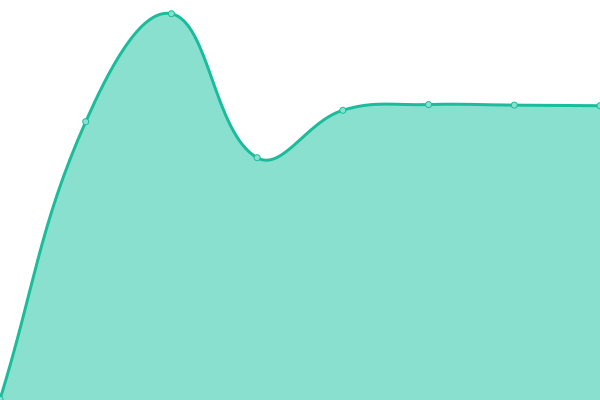

# [📈 Live Status](https://status.constructions-incongrues.net): <!--live status--> **🟧 Partial outage**

This repository contains the open-source uptime monitor and status page for [Constructions Incongrues](https://constructions-incongrues.net), powered by [Upptime](https://github.com/upptime/upptime).

With [Upptime](https://upptime.js.org), you can get your own unlimited and free uptime monitor and status page, powered entirely by a GitHub repository. We use [Issues](https://github.com/constructions-incongrues/status/issues) as incident reports, [Actions](https://github.com/constructions-incongrues/status/actions) as uptime monitors, and [Pages](https://status.constructions-incongrues.net) for the status page.

<!--start: status pages-->
<!-- This summary is generated by Upptime (https://github.com/upptime/upptime) -->
<!-- Do not edit this manually, your changes will be overwritten -->
<!-- prettier-ignore -->
| URL | Status | History | Response Time | Uptime |
| --- | ------ | ------- | ------------- | ------ |
|  [Discutons](https://discutons.incongru.org/) | 🟥 Down | [discutons.yml](https://github.com/constructions-incongrues/status/commits/HEAD/history/discutons.yml) | 

 219ms
     
 | 

<a href="https://status.constructions-incongrues.net/history/discutons">0.00%</a>
    

|  [Le Grand Cahier](https://legrandcahier.incongru.org/) | 🟥 Down | [le-grand-cahier.yml](https://github.com/constructions-incongrues/status/commits/HEAD/history/le-grand-cahier.yml) | 

 204ms
     
 | 

<a href="https://status.constructions-incongrues.net/history/le-grand-cahier">0.00%</a>
    

|  [Musiques Incongrues](https://www.musiques-incongrues.net/forum/) | 🟩 Up | [musiques-incongrues.yml](https://github.com/constructions-incongrues/status/commits/HEAD/history/musiques-incongrues.yml) | 

 881ms
     
 | 

<a href="https://status.constructions-incongrues.net/history/musiques-incongrues">100.00%</a>
    

|  [Musique Approximative](https://www.musiqueapproximative.net) | 🟩 Up | [musique-approximative.yml](https://github.com/constructions-incongrues/status/commits/HEAD/history/musique-approximative.yml) | 

 408ms
     
 | 

<a href="https://status.constructions-incongrues.net/history/musique-approximative">100.00%</a>
    

|  [Da ! Heard It Records](https://www.daheardit-records.net) | 🟩 Up | [da-heard-it-records.yml](https://github.com/constructions-incongrues/status/commits/HEAD/history/da-heard-it-records.yml) | 

 649ms
     
 | 

<a href="https://status.constructions-incongrues.net/history/da-heard-it-records">100.00%</a>
    

|  [Ouïedire](https://www.ouiedire.net) | 🟩 Up | [ouiedire.yml](https://github.com/constructions-incongrues/status/commits/HEAD/history/ouiedire.yml) | 

 1125ms
     
 | 

<a href="https://status.constructions-incongrues.net/history/ouiedire">100.00%</a>
    

<!--end: status pages-->

[**Visit our status website →**](https://status.constructions-incongrues.net)

## 📄 License

- Powered by: [Upptime](https://github.com/upptime/upptime)
- Code: [MIT](./LICENSE) © [Constructions Incongrues](https://constructions-incongrues.net)
- Data in the `./history` directory: [Open Database License](https://opendatacommons.org/licenses/odbl/1-0/)
