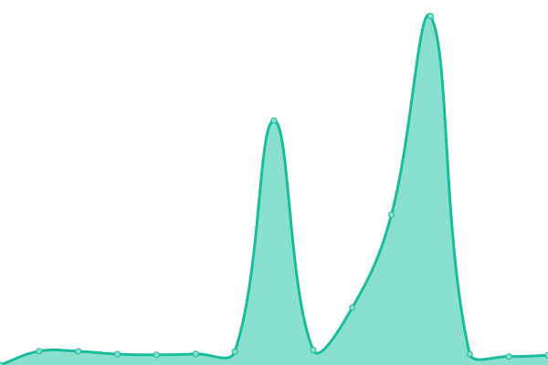
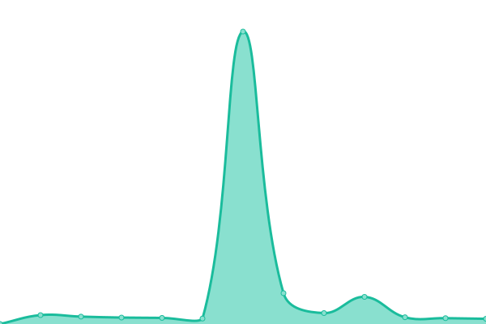
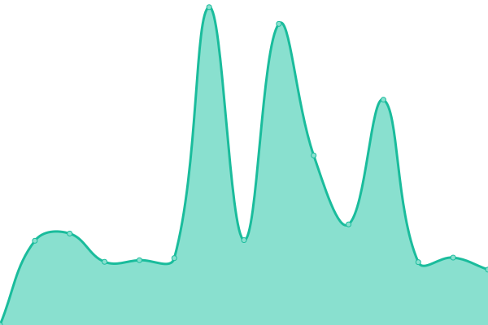

# [📈 Live Status](https://status.constructions-incongrues.net): <!--live status--> **🟩 All systems operational**

This repository contains the open-source uptime monitor and status page for [Constructions Incongrues](https://constructions-incongrues.net), powered by [Upptime](https://github.com/upptime/upptime).

With [Upptime](https://upptime.js.org), you can get your own unlimited and free uptime monitor and status page, powered entirely by a GitHub repository. We use [Issues](https://github.com/constructions-incongrues/status/issues) as incident reports, [Actions](https://github.com/constructions-incongrues/status/actions) as uptime monitors, and [Pages](https://status.constructions-incongrues.net) for the status page.

<!--start: status pages-->
<!-- This summary is generated by Upptime (https://github.com/upptime/upptime) -->
<!-- Do not edit this manually, your changes will be overwritten -->
<!-- prettier-ignore -->
| URL | Status | History | Response Time | Uptime |
| --- | ------ | ------- | ------------- | ------ |
|  [Da ! Heard It Records - home](https://daheardit-records.net/fr/) | 🟩 Up | [da-heard-it-records-home.yml](https://github.com/constructions-incongrues/status/commits/HEAD/history/da-heard-it-records-home.yml) | 

 602ms
     
 | 

<a href="https://status.constructions-incongrues.net/history/da-heard-it-records-home">100.00%</a>
    

|  [Da ! Heard It Records  - api](https://api.daheardit-records.net/) | 🟩 Up | [da-heard-it-records-api.yml](https://github.com/constructions-incongrues/status/commits/HEAD/history/da-heard-it-records-api.yml) | 

 538ms
     
 | 

<a href="https://status.constructions-incongrues.net/history/da-heard-it-records-api">100.00%</a>
    

|  [urlinfo](https://urlinfo.incongru.org/) | 🟩 Up | [urlinfo.yml](https://github.com/constructions-incongrues/status/commits/HEAD/history/urlinfo.yml) | 

 767ms
     
 | 

<a href="https://status.constructions-incongrues.net/history/urlinfo">100.00%</a>
    

|  [Musique Approximative](https://www.musiqueapproximative.net/) | 🟩 Up | [musique-approximative.yml](https://github.com/constructions-incongrues/status/commits/HEAD/history/musique-approximative.yml) | 

 1386ms
     
 | 

<a href="https://status.constructions-incongrues.net/history/musique-approximative">100.00%</a>
    

|  [Radio Approximative](https://radio.musiqueapproximative.net/) | 🟩 Up | [radio-approximative.yml](https://github.com/constructions-incongrues/status/commits/HEAD/history/radio-approximative.yml) | 

 630ms
     
 | 

<a href="https://status.constructions-incongrues.net/history/radio-approximative">100.00%</a>
    

|  [Quickos Chante Noël](https://quickoschantenoel.musiqueapproximative.net/) | 🟩 Up | [quickos-chante-noel.yml](https://github.com/constructions-incongrues/status/commits/HEAD/history/quickos-chante-noel.yml) | 

 1085ms
     
 | 

<a href="https://status.constructions-incongrues.net/history/quickos-chante-noel">100.00%</a>
    

|  [Musiques Incongrues](https://www.musiques-incongrues.net/forum/) | 🟩 Up | [musiques-incongrues.yml](https://github.com/constructions-incongrues/status/commits/HEAD/history/musiques-incongrues.yml) | 

 1534ms
     
 | 

<a href="https://status.constructions-incongrues.net/history/musiques-incongrues">100.00%</a>
    

|  [Sim Bertier](https://simbertier.musiques-incongrues.net/) | 🟩 Up | [sim-bertier.yml](https://github.com/constructions-incongrues/status/commits/HEAD/history/sim-bertier.yml) | 

 640ms
     
 | 

<a href="https://status.constructions-incongrues.net/history/sim-bertier">100.00%</a>
    

|  [Zeitgeist Incongru](https://zeitgeist.musiques-incongrues.net/) | 🟩 Up | [zeitgeist-incongru.yml](https://github.com/constructions-incongrues/status/commits/HEAD/history/zeitgeist-incongru.yml) | 

 1137ms
     
 | 

<a href="https://status.constructions-incongrues.net/history/zeitgeist-incongru">100.00%</a>
    

|  [Ouïedire](https://www.ouiedire.net/) | 🟩 Up | [ouiedire.yml](https://github.com/constructions-incongrues/status/commits/HEAD/history/ouiedire.yml) | 

 744ms
     
 | 

<a href="https://status.constructions-incongrues.net/history/ouiedire">100.00%</a>
    

|  [Pardon My French](https://www.pardon-my-french.fr/) | 🟩 Up | [pardon-my-french.yml](https://github.com/constructions-incongrues/status/commits/HEAD/history/pardon-my-french.yml) | 

 1213ms
     
 | 

<a href="https://status.constructions-incongrues.net/history/pardon-my-french">100.00%</a>
    

|  [Pastis Hosting](https://www.pastis-hosting.net/) | 🟩 Up | [pastis-hosting.yml](https://github.com/constructions-incongrues/status/commits/HEAD/history/pastis-hosting.yml) | 

 454ms
     
 | 

<a href="https://status.constructions-incongrues.net/history/pastis-hosting">100.00%</a>
    

<!--end: status pages-->

[**Visit our status website →**](https://status.constructions-incongrues.net)

## 📄 License

- Powered by: [Upptime](https://github.com/upptime/upptime)
- Code: [MIT](./LICENSE) © [Constructions Incongrues](https://constructions-incongrues.net)
- Data in the `./history` directory: [Open Database License](https://opendatacommons.org/licenses/odbl/1-0/)
