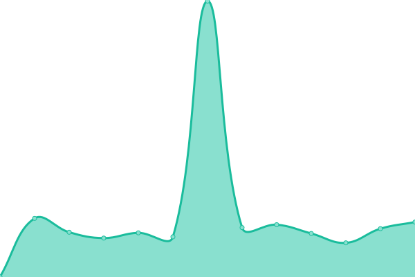

# [📈 Live Status](https://status.constructions-incongrues.net): <!--live status--> **🟧 Partial outage**

This repository contains the open-source uptime monitor and status page for [Constructions Incongrues](https://constructions-incongrues.net), powered by [Upptime](https://github.com/upptime/upptime).

With [Upptime](https://upptime.js.org), you can get your own unlimited and free uptime monitor and status page, powered entirely by a GitHub repository. We use [Issues](https://github.com/constructions-incongrues/status/issues) as incident reports, [Actions](https://github.com/constructions-incongrues/status/actions) as uptime monitors, and [Pages](https://status.constructions-incongrues.net) for the status page.

<!--start: status pages-->
<!-- This summary is generated by Upptime (https://github.com/upptime/upptime) -->
<!-- Do not edit this manually, your changes will be overwritten -->
<!-- prettier-ignore -->
| URL | Status | History | Response Time | Uptime |
| --- | ------ | ------- | ------------- | ------ |
|  [pastis-hosting.net](https://pastis-hosting.net) | 🟥 Down | [pastis-hosting-net.yml](https://github.com/constructions-incongrues/status/commits/HEAD/history/pastis-hosting-net.yml) | 

 0ms
     
 | 

<a href="https://status.constructions-incongrues.net/history/pastis-hosting-net">0.00%</a>
    

|  [rebecca.pastis-hosting.net](https://rebecca.pastis-hosting.net) | 🟩 Up | [rebecca-pastis-hosting-net.yml](https://github.com/constructions-incongrues/status/commits/HEAD/history/rebecca-pastis-hosting-net.yml) | 

 374ms
     
 | 

<a href="https://status.constructions-incongrues.net/history/rebecca-pastis-hosting-net">100.00%</a>
    

|  [mirror.pastis-hosting.net](https://mirror.pastis-hosting.net) | 🟩 Up | [mirror-pastis-hosting-net.yml](https://github.com/constructions-incongrues/status/commits/HEAD/history/mirror-pastis-hosting-net.yml) | 

 315ms
     
 | 

<a href="https://status.constructions-incongrues.net/history/mirror-pastis-hosting-net">100.00%</a>
    

|  [traefik.pastis-hosting.net](https://traefik.pastis-hosting.net) | 🟩 Up | [traefik-pastis-hosting-net.yml](https://github.com/constructions-incongrues/status/commits/HEAD/history/traefik-pastis-hosting-net.yml) | 

 464ms
     
 | 

<a href="https://status.constructions-incongrues.net/history/traefik-pastis-hosting-net">100.00%</a>
    

|  [portainer.pastis-hosting.net](https://portainer.pastis-hosting.net) | 🟩 Up | [portainer-pastis-hosting-net.yml](https://github.com/constructions-incongrues/status/commits/HEAD/history/portainer-pastis-hosting-net.yml) | 

 453ms
     
 | 

<a href="https://status.constructions-incongrues.net/history/portainer-pastis-hosting-net">100.00%</a>
    

|  [docker.pastis-hosting.net](https://docker.pastis-hosting.net) | 🟥 Down | [docker-pastis-hosting-net.yml](https://github.com/constructions-incongrues/status/commits/HEAD/history/docker-pastis-hosting-net.yml) | 

 0ms
     
 | 

<a href="https://status.constructions-incongrues.net/history/docker-pastis-hosting-net">0.00%</a>
    

|  [status.pastis-hosting.net](https://status.pastis-hosting.net) | 🟩 Up | [status-pastis-hosting-net.yml](https://github.com/constructions-incongrues/status/commits/HEAD/history/status-pastis-hosting-net.yml) | 

 55ms
     
 | 

<a href="https://status.constructions-incongrues.net/history/status-pastis-hosting-net">100.00%</a>
    

|  [parishq.net](https://parishq.net) | 🟩 Up | [parishq-net.yml](https://github.com/constructions-incongrues/status/commits/HEAD/history/parishq-net.yml) | 

 449ms
     
 | 

<a href="https://status.constructions-incongrues.net/history/parishq-net">100.00%</a>
    

|  [computertruck.parishq.net](https://computertruck.parishq.net) | 🟩 Up | [computertruck-parishq-net.yml](https://github.com/constructions-incongrues/status/commits/HEAD/history/computertruck-parishq-net.yml) | 

 785ms
     
 | 

<a href="https://status.constructions-incongrues.net/history/computertruck-parishq-net">100.00%</a>
    

|  [divag.parishq.net](https://divag.parishq.net) | 🟩 Up | [divag-parishq-net.yml](https://github.com/constructions-incongrues/status/commits/HEAD/history/divag-parishq-net.yml) | 

 586ms
     
 | 

<a href="https://status.constructions-incongrues.net/history/divag-parishq-net">100.00%</a>
    

|  [gallery.parishq.net](https://gallery.parishq.net) | 🟩 Up | [gallery-parishq-net.yml](https://github.com/constructions-incongrues/status/commits/HEAD/history/gallery-parishq-net.yml) | 

 708ms
     
 | 

<a href="https://status.constructions-incongrues.net/history/gallery-parishq-net">100.00%</a>
    

|  [labitabertier.parishq.net](https://labitabertier.parishq.net) | 🟩 Up | [labitabertier-parishq-net.yml](https://github.com/constructions-incongrues/status/commits/HEAD/history/labitabertier-parishq-net.yml) | 

 456ms
     
 | 

<a href="https://status.constructions-incongrues.net/history/labitabertier-parishq-net">100.00%</a>
    

|  [arrachetoiunoeil.com](https://arrachetoiunoeil.com) | 🟩 Up | [arrachetoiunoeil-com.yml](https://github.com/constructions-incongrues/status/commits/HEAD/history/arrachetoiunoeil-com.yml) | 

 1779ms
     
 | 

<a href="https://status.constructions-incongrues.net/history/arrachetoiunoeil-com">100.00%</a>
    

|  [thebrainradio.com](https://thebrainradio.com) | 🟩 Up | [thebrainradio-com.yml](https://github.com/constructions-incongrues/status/commits/HEAD/history/thebrainradio-com.yml) | 

 355ms
     
 | 

<a href="https://status.constructions-incongrues.net/history/thebrainradio-com">100.00%</a>
    

|  [thisisradioclash.org](https://thisisradioclash.org) | 🟩 Up | [thisisradioclash-org.yml](https://github.com/constructions-incongrues/status/commits/HEAD/history/thisisradioclash-org.yml) | 

 443ms
     
 | 

<a href="https://status.constructions-incongrues.net/history/thisisradioclash-org">100.00%</a>
    

|  [chipndamned.com](https://chipndamned.com) | 🟩 Up | [chipndamned-com.yml](https://github.com/constructions-incongrues/status/commits/HEAD/history/chipndamned-com.yml) | 

 284ms
     
 | 

<a href="https://status.constructions-incongrues.net/history/chipndamned-com">100.00%</a>
    

|  [mazemod.org](https://mazemod.org) | 🟩 Up | [mazemod-org.yml](https://github.com/constructions-incongrues/status/commits/HEAD/history/mazemod-org.yml) | 

 1151ms
     
 | 

<a href="https://status.constructions-incongrues.net/history/mazemod-org">100.00%</a>
    

|  [pardon-my-french.fr](https://pardon-my-french.fr) | 🟩 Up | [pardon-my-french-fr.yml](https://github.com/constructions-incongrues/status/commits/HEAD/history/pardon-my-french-fr.yml) | 

 566ms
     
 | 

<a href="https://status.constructions-incongrues.net/history/pardon-my-french-fr">100.00%</a>
    

|  [millemilliards.net](https://millemilliards.net) | 🟥 Down | [millemilliards-net.yml](https://github.com/constructions-incongrues/status/commits/HEAD/history/millemilliards-net.yml) | 

 0ms
     
 | 

<a href="https://status.constructions-incongrues.net/history/millemilliards-net">0.00%</a>
    

|  [moncul.org](https://moncul.org) | 🟩 Up | [moncul-org.yml](https://github.com/constructions-incongrues/status/commits/HEAD/history/moncul-org.yml) | 

 253ms
     
 | 

<a href="https://status.constructions-incongrues.net/history/moncul-org">100.00%</a>
    

|  [tiragesingrats.millemilliards.net](https://tiragesingrats.millemilliards.net) | 🟩 Up | [tiragesingrats-millemilliards-net.yml](https://github.com/constructions-incongrues/status/commits/HEAD/history/tiragesingrats-millemilliards-net.yml) | 

 11584ms
     
 | 

<a href="https://status.constructions-incongrues.net/history/tiragesingrats-millemilliards-net">100.00%</a>
    

|  [partouze-cagoule.fr](https://partouze-cagoule.fr) | 🟩 Up | [partouze-cagoule-fr.yml](https://github.com/constructions-incongrues/status/commits/HEAD/history/partouze-cagoule-fr.yml) | 

 319ms
     
 | 

<a href="https://status.constructions-incongrues.net/history/partouze-cagoule-fr">100.00%</a>
    

|  [resterdigne.net](https://resterdigne.net) | 🟩 Up | [resterdigne-net.yml](https://github.com/constructions-incongrues/status/commits/HEAD/history/resterdigne-net.yml) | 

 1486ms
     
 | 

<a href="https://status.constructions-incongrues.net/history/resterdigne-net">100.00%</a>
    

|  [mauvaisbon.resterdigne.net](https://mauvaisbon.resterdigne.net) | 🟩 Up | [mauvaisbon-resterdigne-net.yml](https://github.com/constructions-incongrues/status/commits/HEAD/history/mauvaisbon-resterdigne-net.yml) | 

 275ms
     
 | 

<a href="https://status.constructions-incongrues.net/history/mauvaisbon-resterdigne-net">100.00%</a>
    

|  [norme.resterdigne.net](https://norme.resterdigne.net) | 🟩 Up | [norme-resterdigne-net.yml](https://github.com/constructions-incongrues/status/commits/HEAD/history/norme-resterdigne-net.yml) | 

 233ms
     
 | 

<a href="https://status.constructions-incongrues.net/history/norme-resterdigne-net">100.00%</a>
    

|  [cherjournal.resterdigne.net](https://cherjournal.resterdigne.net) | 🟩 Up | [cherjournal-resterdigne-net.yml](https://github.com/constructions-incongrues/status/commits/HEAD/history/cherjournal-resterdigne-net.yml) | 

 276ms
     
 | 

<a href="https://status.constructions-incongrues.net/history/cherjournal-resterdigne-net">100.00%</a>
    

|  [notgay.resterdigne.net](https://notgay.resterdigne.net) | 🟩 Up | [notgay-resterdigne-net.yml](https://github.com/constructions-incongrues/status/commits/HEAD/history/notgay-resterdigne-net.yml) | 

 298ms
     
 | 

<a href="https://status.constructions-incongrues.net/history/notgay-resterdigne-net">100.00%</a>
    

|  [sauvemoidesagios.resterdigne.net](https://sauvemoidesagios.resterdigne.net) | 🟩 Up | [sauvemoidesagios-resterdigne-net.yml](https://github.com/constructions-incongrues/status/commits/HEAD/history/sauvemoidesagios-resterdigne-net.yml) | 

 266ms
     
 | 

<a href="https://status.constructions-incongrues.net/history/sauvemoidesagios-resterdigne-net">100.00%</a>
    

|  [tasp.resterdigne.net](https://tasp.resterdigne.net) | 🟩 Up | [tasp-resterdigne-net.yml](https://github.com/constructions-incongrues/status/commits/HEAD/history/tasp-resterdigne-net.yml) | 

 302ms
     
 | 

<a href="https://status.constructions-incongrues.net/history/tasp-resterdigne-net">100.00%</a>
    

|  [lesetoilesflottantes.resterdigne.net](https://lesetoilesflottantes.resterdigne.net) | 🟩 Up | [lesetoilesflottantes-resterdigne-net.yml](https://github.com/constructions-incongrues/status/commits/HEAD/history/lesetoilesflottantes-resterdigne-net.yml) | 

 288ms
     
 | 

<a href="https://status.constructions-incongrues.net/history/lesetoilesflottantes-resterdigne-net">100.00%</a>
    

|  [fairecaca2017.resterdigne.net](https://fairecaca2017.resterdigne.net) | 🟩 Up | [fairecaca2017-resterdigne-net.yml](https://github.com/constructions-incongrues/status/commits/HEAD/history/fairecaca2017-resterdigne-net.yml) | 

 315ms
     
 | 

<a href="https://status.constructions-incongrues.net/history/fairecaca2017-resterdigne-net">100.00%</a>
    

|  [vincentcesoir.resterdigne.net](https://vincentcesoir.resterdigne.net) | 🟩 Up | [vincentcesoir-resterdigne-net.yml](https://github.com/constructions-incongrues/status/commits/HEAD/history/vincentcesoir-resterdigne-net.yml) | 

 262ms
     
 | 

<a href="https://status.constructions-incongrues.net/history/vincentcesoir-resterdigne-net">100.00%</a>
    

|  [lagrandepurge.resterdigne.net](https://lagrandepurge.resterdigne.net) | 🟩 Up | [lagrandepurge-resterdigne-net.yml](https://github.com/constructions-incongrues/status/commits/HEAD/history/lagrandepurge-resterdigne-net.yml) | 

 1059ms
     
 | 

<a href="https://status.constructions-incongrues.net/history/lagrandepurge-resterdigne-net">100.00%</a>
    

|  [coller.resterdigne.net](https://coller.resterdigne.net) | 🟥 Down | [coller-resterdigne-net.yml](https://github.com/constructions-incongrues/status/commits/HEAD/history/coller-resterdigne-net.yml) | 

 315ms
     
 | 

<a href="https://status.constructions-incongrues.net/history/coller-resterdigne-net">0.00%</a>
    

|  [anomouresbingo.partouze-cagoule.fr](https://anomouresbingo.partouze-cagoule.fr) | 🟩 Up | [anomouresbingo-partouze-cagoule-fr.yml](https://github.com/constructions-incongrues/status/commits/HEAD/history/anomouresbingo-partouze-cagoule-fr.yml) | 

 328ms
     
 | 

<a href="https://status.constructions-incongrues.net/history/anomouresbingo-partouze-cagoule-fr">100.00%</a>
    

|  [kneeporn.partouze-cagoule.fr](https://kneeporn.partouze-cagoule.fr) | 🟩 Up | [kneeporn-partouze-cagoule-fr.yml](https://github.com/constructions-incongrues/status/commits/HEAD/history/kneeporn-partouze-cagoule-fr.yml) | 

 405ms
     
 | 

<a href="https://status.constructions-incongrues.net/history/kneeporn-partouze-cagoule-fr">100.00%</a>
    

|  [brigademondaine.partouze-cagoule.fr](https://brigademondaine.partouze-cagoule.fr) | 🟩 Up | [brigademondaine-partouze-cagoule-fr.yml](https://github.com/constructions-incongrues/status/commits/HEAD/history/brigademondaine-partouze-cagoule-fr.yml) | 

 308ms
     
 | 

<a href="https://status.constructions-incongrues.net/history/brigademondaine-partouze-cagoule-fr">100.00%</a>
    

|  [rosebud.partouze-cagoule.fr](https://rosebud.partouze-cagoule.fr) | 🟩 Up | [rosebud-partouze-cagoule-fr.yml](https://github.com/constructions-incongrues/status/commits/HEAD/history/rosebud-partouze-cagoule-fr.yml) | 

 245ms
     
 | 

<a href="https://status.constructions-incongrues.net/history/rosebud-partouze-cagoule-fr">100.00%</a>
    

|  [legrandcahier.partouze-cagoule.fr](https://legrandcahier.partouze-cagoule.fr) | 🟩 Up | [legrandcahier-partouze-cagoule-fr.yml](https://github.com/constructions-incongrues/status/commits/HEAD/history/legrandcahier-partouze-cagoule-fr.yml) | 

 390ms
     
 | 

<a href="https://status.constructions-incongrues.net/history/legrandcahier-partouze-cagoule-fr">100.00%</a>
    

|  [chattedechevre.partouze-cagoule.fr](https://chattedechevre.partouze-cagoule.fr) | 🟩 Up | [chattedechevre-partouze-cagoule-fr.yml](https://github.com/constructions-incongrues/status/commits/HEAD/history/chattedechevre-partouze-cagoule-fr.yml) | 

 1055ms
     
 | 

<a href="https://status.constructions-incongrues.net/history/chattedechevre-partouze-cagoule-fr">100.00%</a>
    

|  [autoporn.partouze-cagoule.fr](https://autoporn.partouze-cagoule.fr) | 🟩 Up | [autoporn-partouze-cagoule-fr.yml](https://github.com/constructions-incongrues/status/commits/HEAD/history/autoporn-partouze-cagoule-fr.yml) | 

 243ms
     
 | 

<a href="https://status.constructions-incongrues.net/history/autoporn-partouze-cagoule-fr">100.00%</a>
    

|  [letrucapripri.partouze-cagoule.fr](https://letrucapripri.partouze-cagoule.fr) | 🟩 Up | [letrucapripri-partouze-cagoule-fr.yml](https://github.com/constructions-incongrues/status/commits/HEAD/history/letrucapripri-partouze-cagoule-fr.yml) | 

 235ms
     
 | 

<a href="https://status.constructions-incongrues.net/history/letrucapripri-partouze-cagoule-fr">100.00%</a>
    

|  [foutre.partouze-cagoule.fr](https://foutre.partouze-cagoule.fr) | 🟥 Down | [foutre-partouze-cagoule-fr.yml](https://github.com/constructions-incongrues/status/commits/HEAD/history/foutre-partouze-cagoule-fr.yml) | 

 347ms
     
 | 

<a href="https://status.constructions-incongrues.net/history/foutre-partouze-cagoule-fr">0.00%</a>
    

|  [signesexe.partouze-cagoule.fr](https://signesexe.partouze-cagoule.fr) | 🟩 Up | [signesexe-partouze-cagoule-fr.yml](https://github.com/constructions-incongrues/status/commits/HEAD/history/signesexe-partouze-cagoule-fr.yml) | 

 257ms
     
 | 

<a href="https://status.constructions-incongrues.net/history/signesexe-partouze-cagoule-fr">100.00%</a>
    

|  [constructions-incongrues.net](https://constructions-incongrues.net) | 🟩 Up | [constructions-incongrues-net.yml](https://github.com/constructions-incongrues/status/commits/HEAD/history/constructions-incongrues-net.yml) | 

 1980ms
     
 | 

<a href="https://status.constructions-incongrues.net/history/constructions-incongrues-net">100.00%</a>
    

|  [collectionrevue.com](https://collectionrevue.com) | 🟩 Up | [collectionrevue-com.yml](https://github.com/constructions-incongrues/status/commits/HEAD/history/collectionrevue-com.yml) | 

 576ms
     
 | 

<a href="https://status.constructions-incongrues.net/history/collectionrevue-com">100.00%</a>
    

|  [artcomptantpourrien.constructions-incongrues.net](https://artcomptantpourrien.constructions-incongrues.net) | 🟩 Up | [artcomptantpourrien-constructions-incongrues-net.yml](https://github.com/constructions-incongrues/status/commits/HEAD/history/artcomptantpourrien-constructions-incongrues-net.yml) | 

 245ms
     
 | 

<a href="https://status.constructions-incongrues.net/history/artcomptantpourrien-constructions-incongrues-net">100.00%</a>
    

|  [standard.constructions-incongrues.net](https://standard.constructions-incongrues.net) | 🟩 Up | [standard-constructions-incongrues-net.yml](https://github.com/constructions-incongrues/status/commits/HEAD/history/standard-constructions-incongrues-net.yml) | 

 293ms
     
 | 

<a href="https://status.constructions-incongrues.net/history/standard-constructions-incongrues-net">100.00%</a>
    

|  [ivresse.constructions-incongrues.net](https://ivresse.constructions-incongrues.net) | 🟥 Down | [ivresse-constructions-incongrues-net.yml](https://github.com/constructions-incongrues/status/commits/HEAD/history/ivresse-constructions-incongrues-net.yml) | 

 399ms
     
 | 

<a href="https://status.constructions-incongrues.net/history/ivresse-constructions-incongrues-net">0.00%</a>
    

|  [data.constructions-incongrues.net](https://data.constructions-incongrues.net) | 🟩 Up | [data-constructions-incongrues-net.yml](https://github.com/constructions-incongrues/status/commits/HEAD/history/data-constructions-incongrues-net.yml) | 

 243ms
     
 | 

<a href="https://status.constructions-incongrues.net/history/data-constructions-incongrues-net">100.00%</a>
    

|  [musiqueapproximative.net](https://musiqueapproximative.net) | 🟩 Up | [musiqueapproximative-net.yml](https://github.com/constructions-incongrues/status/commits/HEAD/history/musiqueapproximative-net.yml) | 

 641ms
     
 | 

<a href="https://status.constructions-incongrues.net/history/musiqueapproximative-net">100.00%</a>
    

|  [radio.musiqueapproximative.net](https://radio.musiqueapproximative.net) | 🟩 Up | [radio-musiqueapproximative-net.yml](https://github.com/constructions-incongrues/status/commits/HEAD/history/radio-musiqueapproximative-net.yml) | 

 405ms
     
 | 

<a href="https://status.constructions-incongrues.net/history/radio-musiqueapproximative-net">100.00%</a>
    

|  [quickoschantenoel.musiqueapproximative.net](https://quickoschantenoel.musiqueapproximative.net) | 🟩 Up | [quickoschantenoel-musiqueapproximative-net.yml](https://github.com/constructions-incongrues/status/commits/HEAD/history/quickoschantenoel-musiqueapproximative-net.yml) | 

 671ms
     
 | 

<a href="https://status.constructions-incongrues.net/history/quickoschantenoel-musiqueapproximative-net">100.00%</a>
    

|  [musiques-incongrues.net](https://musiques-incongrues.net) | 🟥 Down | [musiques-incongrues-net.yml](https://github.com/constructions-incongrues/status/commits/HEAD/history/musiques-incongrues-net.yml) | 

 1364ms
     
 | 

<a href="https://status.constructions-incongrues.net/history/musiques-incongrues-net">92.05%</a>
    

|  [manager2000.musiques-incongrues.net](https://manager2000.musiques-incongrues.net) | 🟥 Down | [manager2000-musiques-incongrues-net.yml](https://github.com/constructions-incongrues/status/commits/HEAD/history/manager2000-musiques-incongrues-net.yml) | 

 489ms
     
 | 

<a href="https://status.constructions-incongrues.net/history/manager2000-musiques-incongrues-net">0.00%</a>
    

|  [data.musiques-incongrues.net](https://data.musiques-incongrues.net) | 🟥 Down | [data-musiques-incongrues-net.yml](https://github.com/constructions-incongrues/status/commits/HEAD/history/data-musiques-incongrues-net.yml) | 

 520ms
     
 | 

<a href="https://status.constructions-incongrues.net/history/data-musiques-incongrues-net">0.00%</a>
    

|  [zeitgeist.musiques-incongrues.net](https://zeitgeist.musiques-incongrues.net) | 🟩 Up | [zeitgeist-musiques-incongrues-net.yml](https://github.com/constructions-incongrues/status/commits/HEAD/history/zeitgeist-musiques-incongrues-net.yml) | 

 1245ms
     
 | 

<a href="https://status.constructions-incongrues.net/history/zeitgeist-musiques-incongrues-net">100.00%</a>
    

|  [simbertier.musiques-incongrues.net](https://simbertier.musiques-incongrues.net) | 🟩 Up | [simbertier-musiques-incongrues-net.yml](https://github.com/constructions-incongrues/status/commits/HEAD/history/simbertier-musiques-incongrues-net.yml) | 

 501ms
     
 | 

<a href="https://status.constructions-incongrues.net/history/simbertier-musiques-incongrues-net">100.00%</a>
    

|  [ouiedire.net](https://ouiedire.net) | 🟩 Up | [ouiedire-net.yml](https://github.com/constructions-incongrues/status/commits/HEAD/history/ouiedire-net.yml) | 

 1369ms
     
 | 

<a href="https://status.constructions-incongrues.net/history/ouiedire-net">100.00%</a>
    

|  [daheardit-records.net](https://daheardit-records.net) | 🟩 Up | [daheardit-records-net.yml](https://github.com/constructions-incongrues/status/commits/HEAD/history/daheardit-records-net.yml) | 

 794ms
     
 | 

<a href="https://status.constructions-incongrues.net/history/daheardit-records-net">100.00%</a>
    

|  [api.daheardit-records.net](https://api.daheardit-records.net) | 🟥 Down | [api-daheardit-records-net.yml](https://github.com/constructions-incongrues/status/commits/HEAD/history/api-daheardit-records-net.yml) | 

 318ms
     
 | 

<a href="https://status.constructions-incongrues.net/history/api-daheardit-records-net">0.00%</a>
    

|  [leseditionsduchevet.fr](https://leseditionsduchevet.fr) | 🟩 Up | [leseditionsduchevet-fr.yml](https://github.com/constructions-incongrues/status/commits/HEAD/history/leseditionsduchevet-fr.yml) | 

 496ms
     
 | 

<a href="https://status.constructions-incongrues.net/history/leseditionsduchevet-fr">100.00%</a>
    

|  [gouuv.fr](https://gouuv.fr) | 🟥 Down | [gouuv-fr.yml](https://github.com/constructions-incongrues/status/commits/HEAD/history/gouuv-fr.yml) | 

 0ms
     
 | 

<a href="https://status.constructions-incongrues.net/history/gouuv-fr">0.00%</a>
    

|  [ilmanquedesmots.fr](https://ilmanquedesmots.fr) | 🟥 Down | [ilmanquedesmots-fr.yml](https://github.com/constructions-incongrues/status/commits/HEAD/history/ilmanquedesmots-fr.yml) | 

 0ms
     
 | 

<a href="https://status.constructions-incongrues.net/history/ilmanquedesmots-fr">0.00%</a>
    

|  [culture.gouuv.fr](https://culture.gouuv.fr) | 🟥 Down | [culture-gouuv-fr.yml](https://github.com/constructions-incongrues/status/commits/HEAD/history/culture-gouuv-fr.yml) | 

 0ms
     
 | 

<a href="https://status.constructions-incongrues.net/history/culture-gouuv-fr">0.00%</a>
    

|  [interieur.gouuv.fr](https://interieur.gouuv.fr) | 🟥 Down | [interieur-gouuv-fr.yml](https://github.com/constructions-incongrues/status/commits/HEAD/history/interieur-gouuv-fr.yml) | 

 0ms
     
 | 

<a href="https://status.constructions-incongrues.net/history/interieur-gouuv-fr">0.00%</a>
    

|  [memoire.gouuv.fr](https://memoire.gouuv.fr) | 🟥 Down | [memoire-gouuv-fr.yml](https://github.com/constructions-incongrues/status/commits/HEAD/history/memoire-gouuv-fr.yml) | 

 0ms
     
 | 

<a href="https://status.constructions-incongrues.net/history/memoire-gouuv-fr">0.00%</a>
    

|  [portail.gouuv.fr](https://portail.gouuv.fr) | 🟥 Down | [portail-gouuv-fr.yml](https://github.com/constructions-incongrues/status/commits/HEAD/history/portail-gouuv-fr.yml) | 

 0ms
     
 | 

<a href="https://status.constructions-incongrues.net/history/portail-gouuv-fr">0.00%</a>
    

|  [grandirdansdeschamps.ilmanquedesmots.fr](https://grandirdansdeschamps.ilmanquedesmots.fr) | 🟥 Down | [grandirdansdeschamps-ilmanquedesmots-fr.yml](https://github.com/constructions-incongrues/status/commits/HEAD/history/grandirdansdeschamps-ilmanquedesmots-fr.yml) | 

 0ms
     
 | 

<a href="https://status.constructions-incongrues.net/history/grandirdansdeschamps-ilmanquedesmots-fr">0.00%</a>
    

|  [vortex-zine.net](https://vortex-zine.net) | 🟩 Up | [vortex-zine-net.yml](https://github.com/constructions-incongrues/status/commits/HEAD/history/vortex-zine-net.yml) | 

 302ms
     
 | 

<a href="https://status.constructions-incongrues.net/history/vortex-zine-net">100.00%</a>
    

|  [degelite.org](https://degelite.org) | 🟩 Up | [degelite-org.yml](https://github.com/constructions-incongrues/status/commits/HEAD/history/degelite-org.yml) | 

 634ms
     
 | 

<a href="https://status.constructions-incongrues.net/history/degelite-org">100.00%</a>
    

|  [prototop.be](https://prototop.be) | 🟥 Down | [prototop-be.yml](https://github.com/constructions-incongrues/status/commits/HEAD/history/prototop-be.yml) | 

 0ms
     
 | 

<a href="https://status.constructions-incongrues.net/history/prototop-be">0.00%</a>
    

|  [juliadrouhin.com](https://juliadrouhin.com) | 🟩 Up | [juliadrouhin-com.yml](https://github.com/constructions-incongrues/status/commits/HEAD/history/juliadrouhin-com.yml) | 

 360ms
     
 | 

<a href="https://status.constructions-incongrues.net/history/juliadrouhin-com">100.00%</a>
    

|  [odilonparis.com](https://odilonparis.com) | 🟩 Up | [odilonparis-com.yml](https://github.com/constructions-incongrues/status/commits/HEAD/history/odilonparis-com.yml) | 

 228ms
     
 | 

<a href="https://status.constructions-incongrues.net/history/odilonparis-com">100.00%</a>
    

|  [institut-serigraphique.com](https://institut-serigraphique.com) | 🟩 Up | [institut-serigraphique-com.yml](https://github.com/constructions-incongrues/status/commits/HEAD/history/institut-serigraphique-com.yml) | 

 702ms
     
 | 

<a href="https://status.constructions-incongrues.net/history/institut-serigraphique-com">100.00%</a>
    

|  [incongru.org](https://incongru.org) | 🟩 Up | [incongru-org.yml](https://github.com/constructions-incongrues/status/commits/HEAD/history/incongru-org.yml) | 

 469ms
     
 | 

<a href="https://status.constructions-incongrues.net/history/incongru-org">100.00%</a>
    

|  [morphino.incongru.org](https://morphino.incongru.org) | 🟥 Down | [morphino-incongru-org.yml](https://github.com/constructions-incongrues/status/commits/HEAD/history/morphino-incongru-org.yml) | 

 277ms
     
 | 

<a href="https://status.constructions-incongrues.net/history/morphino-incongru-org">0.00%</a>
    

|  [urlinfo.incongru.org](https://urlinfo.incongru.org) | 🟥 Down | [urlinfo-incongru-org.yml](https://github.com/constructions-incongrues/status/commits/HEAD/history/urlinfo-incongru-org.yml) | 

 180ms
     
 | 

<a href="https://status.constructions-incongrues.net/history/urlinfo-incongru-org">0.00%</a>
    

|  [traficdinfluences.incongru.org](https://traficdinfluences.incongru.org) | 🟥 Down | [traficdinfluences-incongru-org.yml](https://github.com/constructions-incongrues/status/commits/HEAD/history/traficdinfluences-incongru-org.yml) | 

 86ms
     
 | 

<a href="https://status.constructions-incongrues.net/history/traficdinfluences-incongru-org">0.00%</a>
    

|  [cochisecomix.incongru.org](https://cochisecomix.incongru.org) | 🟥 Down | [cochisecomix-incongru-org.yml](https://github.com/constructions-incongrues/status/commits/HEAD/history/cochisecomix-incongru-org.yml) | 

 187ms
     
 | 

<a href="https://status.constructions-incongrues.net/history/cochisecomix-incongru-org">0.00%</a>
    

|  [sms.incongru.org](https://sms.incongru.org) | 🟥 Down | [sms-incongru-org.yml](https://github.com/constructions-incongrues/status/commits/HEAD/history/sms-incongru-org.yml) | 

 230ms
     
 | 

<a href="https://status.constructions-incongrues.net/history/sms-incongru-org">0.00%</a>
    

|  [discutons.incongru.org](https://discutons.incongru.org) | 🟥 Down | [discutons-incongru-org.yml](https://github.com/constructions-incongrues/status/commits/HEAD/history/discutons-incongru-org.yml) | 

 181ms
     
 | 

<a href="https://status.constructions-incongrues.net/history/discutons-incongru-org">0.00%</a>
    

|  [trashley.incongru.org](https://trashley.incongru.org) | 🟥 Down | [trashley-incongru-org.yml](https://github.com/constructions-incongrues/status/commits/HEAD/history/trashley-incongru-org.yml) | 

 89ms
     
 | 

<a href="https://status.constructions-incongrues.net/history/trashley-incongru-org">0.00%</a>
    

|  [valkiri.incongru.org](https://valkiri.incongru.org) | 🟥 Down | [valkiri-incongru-org.yml](https://github.com/constructions-incongrues/status/commits/HEAD/history/valkiri-incongru-org.yml) | 

 74ms
     
 | 

<a href="https://status.constructions-incongrues.net/history/valkiri-incongru-org">0.00%</a>
    

|  [peurpanique.incongru.org](https://peurpanique.incongru.org) | 🟥 Down | [peurpanique-incongru-org.yml](https://github.com/constructions-incongrues/status/commits/HEAD/history/peurpanique-incongru-org.yml) | 

 187ms
     
 | 

<a href="https://status.constructions-incongrues.net/history/peurpanique-incongru-org">0.00%</a>
    

|  [pyramideoeilsaucisse.incongru.org](https://pyramideoeilsaucisse.incongru.org) | 🟥 Down | [pyramideoeilsaucisse-incongru-org.yml](https://github.com/constructions-incongrues/status/commits/HEAD/history/pyramideoeilsaucisse-incongru-org.yml) | 

 258ms
     
 | 

<a href="https://status.constructions-incongrues.net/history/pyramideoeilsaucisse-incongru-org">0.00%</a>
    

|  [empilements.incongru.org](https://empilements.incongru.org) | 🟥 Down | [empilements-incongru-org.yml](https://github.com/constructions-incongrues/status/commits/HEAD/history/empilements-incongru-org.yml) | 

 75ms
     
 | 

<a href="https://status.constructions-incongrues.net/history/empilements-incongru-org">0.00%</a>
    

|  [cheloutonson.incongru.org](https://cheloutonson.incongru.org) | 🟥 Down | [cheloutonson-incongru-org.yml](https://github.com/constructions-incongrues/status/commits/HEAD/history/cheloutonson-incongru-org.yml) | 

 80ms
     
 | 

<a href="https://status.constructions-incongrues.net/history/cheloutonson-incongru-org">0.00%</a>
    

|  [johan.wip.incongru.org](https://johan.wip.incongru.org) | 🟥 Down | [johan-wip-incongru-org.yml](https://github.com/constructions-incongrues/status/commits/HEAD/history/johan-wip-incongru-org.yml) | 

 0ms
     
 | 

<a href="https://status.constructions-incongrues.net/history/johan-wip-incongru-org">0.00%</a>
    

|  [globalmix.incongru.org](https://globalmix.incongru.org) | 🟥 Down | [globalmix-incongru-org.yml](https://github.com/constructions-incongrues/status/commits/HEAD/history/globalmix-incongru-org.yml) | 

 71ms
     
 | 

<a href="https://status.constructions-incongrues.net/history/globalmix-incongru-org">0.00%</a>
    

|  [learoger.incongru.org](https://learoger.incongru.org) | 🟥 Down | [learoger-incongru-org.yml](https://github.com/constructions-incongrues/status/commits/HEAD/history/learoger-incongru-org.yml) | 

 70ms
     
 | 

<a href="https://status.constructions-incongrues.net/history/learoger-incongru-org">0.00%</a>
    

|  [joyeuxavaversaire.incongru.org](https://joyeuxavaversaire.incongru.org) | 🟥 Down | [joyeuxavaversaire-incongru-org.yml](https://github.com/constructions-incongrues/status/commits/HEAD/history/joyeuxavaversaire-incongru-org.yml) | 

 78ms
     
 | 

<a href="https://status.constructions-incongrues.net/history/joyeuxavaversaire-incongru-org">0.00%</a>
    

|  [frictions.incongru.org](https://frictions.incongru.org) | 🟥 Down | [frictions-incongru-org.yml](https://github.com/constructions-incongrues/status/commits/HEAD/history/frictions-incongru-org.yml) | 

 282ms
     
 | 

<a href="https://status.constructions-incongrues.net/history/frictions-incongru-org">0.00%</a>
    

|  [hourrapourfrederic.incongru.org](https://hourrapourfrederic.incongru.org) | 🟥 Down | [hourrapourfrederic-incongru-org.yml](https://github.com/constructions-incongrues/status/commits/HEAD/history/hourrapourfrederic-incongru-org.yml) | 

 72ms
     
 | 

<a href="https://status.constructions-incongrues.net/history/hourrapourfrederic-incongru-org">0.00%</a>
    

|  [orangejuicerecords.incongru.org](https://orangejuicerecords.incongru.org) | 🟥 Down | [orangejuicerecords-incongru-org.yml](https://github.com/constructions-incongrues/status/commits/HEAD/history/orangejuicerecords-incongru-org.yml) | 

 83ms
     
 | 

<a href="https://status.constructions-incongrues.net/history/orangejuicerecords-incongru-org">0.00%</a>
    

|  [gong.incongru.org](https://gong.incongru.org) | 🟥 Down | [gong-incongru-org.yml](https://github.com/constructions-incongrues/status/commits/HEAD/history/gong-incongru-org.yml) | 

 77ms
     
 | 

<a href="https://status.constructions-incongrues.net/history/gong-incongru-org">0.00%</a>
    

|  [icecast.incongru.org](https://icecast.incongru.org) | 🟥 Down | [icecast-incongru-org.yml](https://github.com/constructions-incongrues/status/commits/HEAD/history/icecast-incongru-org.yml) | 

 69ms
     
 | 

<a href="https://status.constructions-incongrues.net/history/icecast-incongru-org">0.56%</a>
    

|  [rebeccarium.incongru.org](https://rebeccarium.incongru.org) | 🟥 Down | [rebeccarium-incongru-org.yml](https://github.com/constructions-incongrues/status/commits/HEAD/history/rebeccarium-incongru-org.yml) | 

 76ms
     
 | 

<a href="https://status.constructions-incongrues.net/history/rebeccarium-incongru-org">0.69%</a>
    

|  [ruedesgardes.incongru.org](https://ruedesgardes.incongru.org) | 🟥 Down | [ruedesgardes-incongru-org.yml](https://github.com/constructions-incongrues/status/commits/HEAD/history/ruedesgardes-incongru-org.yml) | 

 66ms
     
 | 

<a href="https://status.constructions-incongrues.net/history/ruedesgardes-incongru-org">0.30%</a>
    

|  [mubadi.incongru.org](https://mubadi.incongru.org) | 🟥 Down | [mubadi-incongru-org.yml](https://github.com/constructions-incongrues/status/commits/HEAD/history/mubadi-incongru-org.yml) | 

 72ms
     
 | 

<a href="https://status.constructions-incongrues.net/history/mubadi-incongru-org">0.44%</a>
    

|  [want.incongru.org](https://want.incongru.org) | 🟥 Down | [want-incongru-org.yml](https://github.com/constructions-incongrues/status/commits/HEAD/history/want-incongru-org.yml) | 

 82ms
     
 | 

<a href="https://status.constructions-incongrues.net/history/want-incongru-org">0.56%</a>
    

|  [benetbene.incongru.org](https://benetbene.incongru.org) | 🟥 Down | [benetbene-incongru-org.yml](https://github.com/constructions-incongrues/status/commits/HEAD/history/benetbene-incongru-org.yml) | 

 70ms
     
 | 

<a href="https://status.constructions-incongrues.net/history/benetbene-incongru-org">0.69%</a>
    

|  [miaou.incongru.org](https://miaou.incongru.org) | 🟥 Down | [miaou-incongru-org.yml](https://github.com/constructions-incongrues/status/commits/HEAD/history/miaou-incongru-org.yml) | 

 205ms
     
 | 

<a href="https://status.constructions-incongrues.net/history/miaou-incongru-org">0.29%</a>
    

|  [radiomomi.incongru.org](https://radiomomi.incongru.org) | 🟥 Down | [radiomomi-incongru-org.yml](https://github.com/constructions-incongrues/status/commits/HEAD/history/radiomomi-incongru-org.yml) | 

 70ms
     
 | 

<a href="https://status.constructions-incongrues.net/history/radiomomi-incongru-org">0.41%</a>
    

|  [spoliature.incongru.org](https://spoliature.incongru.org) | 🟥 Down | [spoliature-incongru-org.yml](https://github.com/constructions-incongrues/status/commits/HEAD/history/spoliature-incongru-org.yml) | 

 78ms
     
 | 

<a href="https://status.constructions-incongrues.net/history/spoliature-incongru-org">0.54%</a>
    

|  [barren.incongru.org](https://barren.incongru.org) | 🟥 Down | [barren-incongru-org.yml](https://github.com/constructions-incongrues/status/commits/HEAD/history/barren-incongru-org.yml) | 

 66ms
     
 | 

<a href="https://status.constructions-incongrues.net/history/barren-incongru-org">0.13%</a>
    

|  [tdm.incongru.org](https://tdm.incongru.org) | 🟩 Up | [tdm-incongru-org.yml](https://github.com/constructions-incongrues/status/commits/HEAD/history/tdm-incongru-org.yml) | 

 391ms
     
 | 

<a href="https://status.constructions-incongrues.net/history/tdm-incongru-org">100.00%</a>
    

|  [iculaire.incongru.org](https://iculaire.incongru.org) | 🟥 Down | [iculaire-incongru-org.yml](https://github.com/constructions-incongrues/status/commits/HEAD/history/iculaire-incongru-org.yml) | 

 90ms
     
 | 

<a href="https://status.constructions-incongrues.net/history/iculaire-incongru-org">0.47%</a>
    

|  [lesetoilesflottantes.incongru.org](https://lesetoilesflottantes.incongru.org) | 🟥 Down | [lesetoilesflottantes-incongru-org.yml](https://github.com/constructions-incongrues/status/commits/HEAD/history/lesetoilesflottantes-incongru-org.yml) | 

 70ms
     
 | 

<a href="https://status.constructions-incongrues.net/history/lesetoilesflottantes-incongru-org">0.63%</a>
    

|  [officialdatabase.incongru.org](https://officialdatabase.incongru.org) | 🟥 Down | [officialdatabase-incongru-org.yml](https://github.com/constructions-incongrues/status/commits/HEAD/history/officialdatabase-incongru-org.yml) | 

 67ms
     
 | 

<a href="https://status.constructions-incongrues.net/history/officialdatabase-incongru-org">0.20%</a>
    

|  [blenno.incongru.org](https://blenno.incongru.org) | 🟥 Down | [blenno-incongru-org.yml](https://github.com/constructions-incongrues/status/commits/HEAD/history/blenno-incongru-org.yml) | 

 71ms
     
 | 

<a href="https://status.constructions-incongrues.net/history/blenno-incongru-org">0.00%</a>
    

|  [legrandcahier.incongru.org](https://legrandcahier.incongru.org) | 🟥 Down | [legrandcahier-incongru-org.yml](https://github.com/constructions-incongrues/status/commits/HEAD/history/legrandcahier-incongru-org.yml) | 

 321ms
     
 | 

<a href="https://status.constructions-incongrues.net/history/legrandcahier-incongru-org">0.00%</a>
    

|  [bonjourlambiance.incongru.org](https://bonjourlambiance.incongru.org) | 🟥 Down | [bonjourlambiance-incongru-org.yml](https://github.com/constructions-incongrues/status/commits/HEAD/history/bonjourlambiance-incongru-org.yml) | 

 75ms
     
 | 

<a href="https://status.constructions-incongrues.net/history/bonjourlambiance-incongru-org">0.10%</a>
    

|  [anodin.incongru.org](https://anodin.incongru.org) | 🟥 Down | [anodin-incongru-org.yml](https://github.com/constructions-incongrues/status/commits/HEAD/history/anodin-incongru-org.yml) | 

 81ms
     
 | 

<a href="https://status.constructions-incongrues.net/history/anodin-incongru-org">0.23%</a>
    

|  [julienkedryna.com](https://julienkedryna.com) | 🟥 Down | [julienkedryna-com.yml](https://github.com/constructions-incongrues/status/commits/HEAD/history/julienkedryna-com.yml) | 

 0ms
     
 | 

<a href="https://status.constructions-incongrues.net/history/julienkedryna-com">0.37%</a>
    

|  [osilasi.com](https://osilasi.com) | 🟥 Down | [osilasi-com.yml](https://github.com/constructions-incongrues/status/commits/HEAD/history/osilasi-com.yml) | 

 0ms
     
 | 

<a href="https://status.constructions-incongrues.net/history/osilasi-com">0.50%</a>
    

|  [mailleret.fr](https://mailleret.fr) | 🟥 Down | [mailleret-fr.yml](https://github.com/constructions-incongrues/status/commits/HEAD/history/mailleret-fr.yml) | 

 0ms
     
 | 

<a href="https://status.constructions-incongrues.net/history/mailleret-fr">0.67%</a>
    

|  [lelaboratoire.be](https://lelaboratoire.be) | 🟩 Up | [lelaboratoire-be.yml](https://github.com/constructions-incongrues/status/commits/HEAD/history/lelaboratoire-be.yml) | 

 914ms
     
 | 

<a href="https://status.constructions-incongrues.net/history/lelaboratoire-be">100.00%</a>
    

|  [mobyone.net](https://mobyone.net) | 🟥 Down | [mobyone-net.yml](https://github.com/constructions-incongrues/status/commits/HEAD/history/mobyone-net.yml) | 

 0ms
     
 | 

<a href="https://status.constructions-incongrues.net/history/mobyone-net">0.34%</a>
    

|  [lionelfernandez.net](https://lionelfernandez.net) | 🟥 Down | [lionelfernandez-net.yml](https://github.com/constructions-incongrues/status/commits/HEAD/history/lionelfernandez-net.yml) | 

 0ms
     
 | 

<a href="https://status.constructions-incongrues.net/history/lionelfernandez-net">100.00%</a>
    

|  [partimondialiste.org](https://partimondialiste.org) | 🟥 Down | [partimondialiste-org.yml](https://github.com/constructions-incongrues/status/commits/HEAD/history/partimondialiste-org.yml) | 

 0ms
     
 | 

<a href="https://status.constructions-incongrues.net/history/partimondialiste-org">100.00%</a>
    

|  [modelepuissance.com](https://modelepuissance.com) | 🟥 Down | [modelepuissance-com.yml](https://github.com/constructions-incongrues/status/commits/HEAD/history/modelepuissance-com.yml) | 

 0ms
     
 | 

<a href="https://status.constructions-incongrues.net/history/modelepuissance-com">100.00%</a>
    

|  [nohmad.net](https://nohmad.net) | 🟩 Up | [nohmad-net.yml](https://github.com/constructions-incongrues/status/commits/HEAD/history/nohmad-net.yml) | 

 2235ms
     
 | 

<a href="https://status.constructions-incongrues.net/history/nohmad-net">100.00%</a>
    

|  [sammystein.fr](https://sammystein.fr) | 🟥 Down | [sammystein-fr.yml](https://github.com/constructions-incongrues/status/commits/HEAD/history/sammystein-fr.yml) | 

 0ms
     
 | 

<a href="https://status.constructions-incongrues.net/history/sammystein-fr">0.00%</a>
    

|  [ava.mailleret.fr](https://ava.mailleret.fr) | 🟩 Up | [ava-mailleret-fr.yml](https://github.com/constructions-incongrues/status/commits/HEAD/history/ava-mailleret-fr.yml) | 

 640ms
     
 | 

<a href="https://status.constructions-incongrues.net/history/ava-mailleret-fr">100.00%</a>
    

|  [julien.mailleret.fr](https://julien.mailleret.fr) | 🟩 Up | [julien-mailleret-fr.yml](https://github.com/constructions-incongrues/status/commits/HEAD/history/julien-mailleret-fr.yml) | 

 453ms
     
 | 

<a href="https://status.constructions-incongrues.net/history/julien-mailleret-fr">100.00%</a>
    

|  [thirdtypetapes.com](https://thirdtypetapes.com) | 🟩 Up | [thirdtypetapes-com.yml](https://github.com/constructions-incongrues/status/commits/HEAD/history/thirdtypetapes-com.yml) | 

 1240ms
     
 | 

<a href="https://status.constructions-incongrues.net/history/thirdtypetapes-com">100.00%</a>
    

|  [serendip-arts.org](https://serendip-arts.org) | 🟥 Down | [serendip-arts-org.yml](https://github.com/constructions-incongrues/status/commits/HEAD/history/serendip-arts-org.yml) | 

 0ms
     
 | 

<a href="https://status.constructions-incongrues.net/history/serendip-arts-org">0.00%</a>
    

|  [serendip-lab.net](https://serendip-lab.net) | 🟩 Up | [serendip-lab-net.yml](https://github.com/constructions-incongrues/status/commits/HEAD/history/serendip-lab-net.yml) | 

 2063ms
     
 | 

<a href="https://status.constructions-incongrues.net/history/serendip-lab-net">100.00%</a>
    

|  [transcyberien.org](https://transcyberien.org) | 🟩 Up | [transcyberien-org.yml](https://github.com/constructions-incongrues/status/commits/HEAD/history/transcyberien-org.yml) | 

 448ms
     
 | 

<a href="https://status.constructions-incongrues.net/history/transcyberien-org">100.00%</a>
    

|  [silicate.tv](https://silicate.tv) | 🟩 Up | [silicate-tv.yml](https://github.com/constructions-incongrues/status/commits/HEAD/history/silicate-tv.yml) | 

 404ms
     
 | 

<a href="https://status.constructions-incongrues.net/history/silicate-tv">100.00%</a>
    

|  [serendip-lab.org](https://serendip-lab.org) | 🟥 Down | [serendip-lab-org.yml](https://github.com/constructions-incongrues/status/commits/HEAD/history/serendip-lab-org.yml) | 

 0ms
     
 | 

<a href="https://status.constructions-incongrues.net/history/serendip-lab-org">0.00%</a>
    

|  [tele-incongrue.net](https://tele-incongrue.net) | 🟥 Down | [tele-incongrue-net.yml](https://github.com/constructions-incongrues/status/commits/HEAD/history/tele-incongrue-net.yml) | 

 0ms
     
 | 

<a href="https://status.constructions-incongrues.net/history/tele-incongrue-net">0.00%</a>
    

|  [yvanbabillon.com](https://yvanbabillon.com) | 🟥 Down | [yvanbabillon-com.yml](https://github.com/constructions-incongrues/status/commits/HEAD/history/yvanbabillon-com.yml) | 

 0ms
     
 | 

<a href="https://status.constructions-incongrues.net/history/yvanbabillon-com">0.00%</a>
    

|  [sisterart.net](https://sisterart.net) | 🟩 Up | [sisterart-net.yml](https://github.com/constructions-incongrues/status/commits/HEAD/history/sisterart-net.yml) | 

 491ms
     
 | 

<a href="https://status.constructions-incongrues.net/history/sisterart-net">100.00%</a>
    

|  [spielzeugmuzak.net](https://spielzeugmuzak.net) | 🟩 Up | [spielzeugmuzak-net.yml](https://github.com/constructions-incongrues/status/commits/HEAD/history/spielzeugmuzak-net.yml) | 

 783ms
     
 | 

<a href="https://status.constructions-incongrues.net/history/spielzeugmuzak-net">100.00%</a>
    

|  [next.serendip-lab.org](https://next.serendip-lab.org) | 🟥 Down | [next-serendip-lab-org.yml](https://github.com/constructions-incongrues/status/commits/HEAD/history/next-serendip-lab-org.yml) | 

 0ms
     
 | 

<a href="https://status.constructions-incongrues.net/history/next-serendip-lab-org">0.00%</a>
    

|  [dolina.spielzeugmuzak.net](https://dolina.spielzeugmuzak.net) | 🟥 Down | [dolina-spielzeugmuzak-net.yml](https://github.com/constructions-incongrues/status/commits/HEAD/history/dolina-spielzeugmuzak-net.yml) | 

 0ms
     
 | 

<a href="https://status.constructions-incongrues.net/history/dolina-spielzeugmuzak-net">0.00%</a>
    

|  [villapiegee.spielzeugmuzak.net](https://villapiegee.spielzeugmuzak.net) | 🟥 Down | [villapiegee-spielzeugmuzak-net.yml](https://github.com/constructions-incongrues/status/commits/HEAD/history/villapiegee-spielzeugmuzak-net.yml) | 

 0ms
     
 | 

<a href="https://status.constructions-incongrues.net/history/villapiegee-spielzeugmuzak-net">0.00%</a>
    

|  [jeunesse-fantome.spielzeugmuzak.net](https://jeunesse-fantome.spielzeugmuzak.net) | 🟥 Down | [jeunesse-fantome-spielzeugmuzak-net.yml](https://github.com/constructions-incongrues/status/commits/HEAD/history/jeunesse-fantome-spielzeugmuzak-net.yml) | 

 0ms
     
 | 

<a href="https://status.constructions-incongrues.net/history/jeunesse-fantome-spielzeugmuzak-net">0.00%</a>
    

|  [elisekobischmiana.com](https://elisekobischmiana.com) | 🟩 Up | [elisekobischmiana-com.yml](https://github.com/constructions-incongrues/status/commits/HEAD/history/elisekobischmiana-com.yml) | 

 654ms
     
 | 

<a href="https://status.constructions-incongrues.net/history/elisekobischmiana-com">100.00%</a>
    

|  [elodierassel.com](https://elodierassel.com) | 🟥 Down | [elodierassel-com.yml](https://github.com/constructions-incongrues/status/commits/HEAD/history/elodierassel-com.yml) | 

 0ms
     
 | 

<a href="https://status.constructions-incongrues.net/history/elodierassel-com">0.00%</a>
    

|  [groprout.art](https://groprout.art) | 🟥 Down | [groprout-art.yml](https://github.com/constructions-incongrues/status/commits/HEAD/history/groprout-art.yml) | 

 0ms
     
 | 

<a href="https://status.constructions-incongrues.net/history/groprout-art">0.00%</a>
    

|  [glafouk.com](https://glafouk.com) | 🟩 Up | [glafouk-com.yml](https://github.com/constructions-incongrues/status/commits/HEAD/history/glafouk-com.yml) | 

 821ms
     
 | 

<a href="https://status.constructions-incongrues.net/history/glafouk-com">100.00%</a>
    

|  [xn--gr-gka.com](https://xn--gr-gka.com) | 🟩 Up | [xn-gr-gka-com.yml](https://github.com/constructions-incongrues/status/commits/HEAD/history/xn-gr-gka-com.yml) | 

 1041ms
     
 | 

<a href="https://status.constructions-incongrues.net/history/xn-gr-gka-com">100.00%</a>
    

|  [amandinemeyer.com](https://amandinemeyer.com) | 🟩 Up | [amandinemeyer-com.yml](https://github.com/constructions-incongrues/status/commits/HEAD/history/amandinemeyer-com.yml) | 

 695ms
     
 | 

<a href="https://status.constructions-incongrues.net/history/amandinemeyer-com">100.00%</a>
    

|  [galerie-e2.org](https://galerie-e2.org) | 🟥 Down | [galerie-e2-org.yml](https://github.com/constructions-incongrues/status/commits/HEAD/history/galerie-e2-org.yml) | 

 0ms
     
 | 

<a href="https://status.constructions-incongrues.net/history/galerie-e2-org">0.00%</a>
    

|  [gravuresommaire.org](https://gravuresommaire.org) | 🟥 Down | [gravuresommaire-org.yml](https://github.com/constructions-incongrues/status/commits/HEAD/history/gravuresommaire-org.yml) | 

 0ms
     
 | 

<a href="https://status.constructions-incongrues.net/history/gravuresommaire-org">0.00%</a>
    

|  [brkcore.fr](https://brkcore.fr) | 🟩 Up | [brkcore-fr.yml](https://github.com/constructions-incongrues/status/commits/HEAD/history/brkcore-fr.yml) | 

 1560ms
     
 | 

<a href="https://status.constructions-incongrues.net/history/brkcore-fr">100.00%</a>
    

|  [dessinssanspapiers.org](https://dessinssanspapiers.org) | 🟥 Down | [dessinssanspapiers-org.yml](https://github.com/constructions-incongrues/status/commits/HEAD/history/dessinssanspapiers-org.yml) | 

 0ms
     
 | 

<a href="https://status.constructions-incongrues.net/history/dessinssanspapiers-org">0.00%</a>
    

|  [eva.xn--gr-gka.com](https://eva.xn--gr-gka.com) | 🟩 Up | [eva-xn-gr-gka-com.yml](https://github.com/constructions-incongrues/status/commits/HEAD/history/eva-xn-gr-gka-com.yml) | 

 714ms
     
 | 

<a href="https://status.constructions-incongrues.net/history/eva-xn-gr-gka-com">100.00%</a>
    

|  [bryanbeast.galerie-e2.org](https://bryanbeast.galerie-e2.org) | 🟥 Down | [bryanbeast-galerie-e2-org.yml](https://github.com/constructions-incongrues/status/commits/HEAD/history/bryanbeast-galerie-e2-org.yml) | 

 0ms
     
 | 

<a href="https://status.constructions-incongrues.net/history/bryanbeast-galerie-e2-org">0.00%</a>
    

|  [darlingdada.com](https://darlingdada.com) | 🟩 Up | [darlingdada-com.yml](https://github.com/constructions-incongrues/status/commits/HEAD/history/darlingdada-com.yml) | 

 2569ms
     
 | 

<a href="https://status.constructions-incongrues.net/history/darlingdada-com">100.00%</a>
    

|  [desorcelerlafinance.org](https://desorcelerlafinance.org) | 🟩 Up | [desorcelerlafinance-org.yml](https://github.com/constructions-incongrues/status/commits/HEAD/history/desorcelerlafinance-org.yml) | 

 1977ms
     
 | 

<a href="https://status.constructions-incongrues.net/history/desorcelerlafinance-org">100.00%</a>
    

|  [forum.desorcelerlafinance.org](https://forum.desorcelerlafinance.org) | 🟥 Down | [forum-desorcelerlafinance-org.yml](https://github.com/constructions-incongrues/status/commits/HEAD/history/forum-desorcelerlafinance-org.yml) | 

 0ms
     
 | 

<a href="https://status.constructions-incongrues.net/history/forum-desorcelerlafinance-org">0.00%</a>
    

|  [10courts10perces.incongru.org](https://10courts10perces.incongru.org) | 🟩 Up | [10courts10perces-incongru-org.yml](https://github.com/constructions-incongrues/status/commits/HEAD/history/10courts10perces-incongru-org.yml) | 

 382ms
     
 | 

<a href="https://status.constructions-incongrues.net/history/10courts10perces-incongru-org">100.00%</a>
    

|  [jouretnuit.incongru.org](https://jouretnuit.incongru.org) | 🟩 Up | [jouretnuit-incongru-org.yml](https://github.com/constructions-incongrues/status/commits/HEAD/history/jouretnuit-incongru-org.yml) | 

 463ms
     
 | 

<a href="https://status.constructions-incongrues.net/history/jouretnuit-incongru-org">100.00%</a>
    

|  [oyibo.incongru.org](https://oyibo.incongru.org) | 🟩 Up | [oyibo-incongru-org.yml](https://github.com/constructions-incongrues/status/commits/HEAD/history/oyibo-incongru-org.yml) | 

 301ms
     
 | 

<a href="https://status.constructions-incongrues.net/history/oyibo-incongru-org">100.00%</a>
    

|  [dansmoncaca.resterdigne.net](https://dansmoncaca.resterdigne.net) | 🟩 Up | [dansmoncaca-resterdigne-net.yml](https://github.com/constructions-incongrues/status/commits/HEAD/history/dansmoncaca-resterdigne-net.yml) | 

 264ms
     
 | 

<a href="https://status.constructions-incongrues.net/history/dansmoncaca-resterdigne-net">100.00%</a>
    

|  [nulsidecouvert.org](https://nulsidecouvert.org) | 🟩 Up | [nulsidecouvert-org.yml](https://github.com/constructions-incongrues/status/commits/HEAD/history/nulsidecouvert-org.yml) | 

 338ms
     
 | 

<a href="https://status.constructions-incongrues.net/history/nulsidecouvert-org">100.00%</a>
    

|  [violentnarcissus.incongru.org](https://violentnarcissus.incongru.org) | 🟩 Up | [violentnarcissus-incongru-org.yml](https://github.com/constructions-incongrues/status/commits/HEAD/history/violentnarcissus-incongru-org.yml) | 

 473ms
     
 | 

<a href="https://status.constructions-incongrues.net/history/violentnarcissus-incongru-org">100.00%</a>
    

|  [dev.daheardit-records.net](https://dev.daheardit-records.net) | 🟩 Up | [dev-daheardit-records-net.yml](https://github.com/constructions-incongrues/status/commits/HEAD/history/dev-daheardit-records-net.yml) | 

 703ms
     
 | 

<a href="https://status.constructions-incongrues.net/history/dev-daheardit-records-net">100.00%</a>
    

|  [ptigab.incongru.org](https://ptigab.incongru.org) | 🟥 Down | [ptigab-incongru-org.yml](https://github.com/constructions-incongrues/status/commits/HEAD/history/ptigab-incongru-org.yml) | 

 68ms
     
 | 

<a href="https://status.constructions-incongrues.net/history/ptigab-incongru-org">0.00%</a>
    

|  [ruedesgardes.org](https://ruedesgardes.org) | 🟥 Down | [ruedesgardes-org.yml](https://github.com/constructions-incongrues/status/commits/HEAD/history/ruedesgardes-org.yml) | 

 0ms
     
 | 

<a href="https://status.constructions-incongrues.net/history/ruedesgardes-org">0.00%</a>
    

|  [airedejeux.ruedesgardes.org](https://airedejeux.ruedesgardes.org) | 🟩 Up | [airedejeux-ruedesgardes-org.yml](https://github.com/constructions-incongrues/status/commits/HEAD/history/airedejeux-ruedesgardes-org.yml) | 

 424ms
     
 | 

<a href="https://status.constructions-incongrues.net/history/airedejeux-ruedesgardes-org">100.00%</a>
    

|  [nbtb.resterdigne.net](https://nbtb.resterdigne.net) | 🟩 Up | [nbtb-resterdigne-net.yml](https://github.com/constructions-incongrues/status/commits/HEAD/history/nbtb-resterdigne-net.yml) | 

 249ms
     
 | 

<a href="https://status.constructions-incongrues.net/history/nbtb-resterdigne-net">100.00%</a>
    

|  [lou.partouze-cagoule.fr](https://lou.partouze-cagoule.fr) | 🟩 Up | [lou-partouze-cagoule-fr.yml](https://github.com/constructions-incongrues/status/commits/HEAD/history/lou-partouze-cagoule-fr.yml) | 

 320ms
     
 | 

<a href="https://status.constructions-incongrues.net/history/lou-partouze-cagoule-fr">100.00%</a>
    

|  [akomovement.incongru.org](https://akomovement.incongru.org) | 🟩 Up | [akomovement-incongru-org.yml](https://github.com/constructions-incongrues/status/commits/HEAD/history/akomovement-incongru-org.yml) | 

 2440ms
     
 | 

<a href="https://status.constructions-incongrues.net/history/akomovement-incongru-org">100.00%</a>
    

|  [evamuse.incongru.org](https://evamuse.incongru.org) | 🟥 Down | [evamuse-incongru-org.yml](https://github.com/constructions-incongrues/status/commits/HEAD/history/evamuse-incongru-org.yml) | 

 69ms
     
 | 

<a href="https://status.constructions-incongrues.net/history/evamuse-incongru-org">0.00%</a>
    

|  [ecrituresporadique.incongru.org](https://ecrituresporadique.incongru.org) | 🟩 Up | [ecrituresporadique-incongru-org.yml](https://github.com/constructions-incongrues/status/commits/HEAD/history/ecrituresporadique-incongru-org.yml) | 

 408ms
     
 | 

<a href="https://status.constructions-incongrues.net/history/ecrituresporadique-incongru-org">100.00%</a>
    

|  [eva.incongru.org](https://eva.incongru.org) | 🟩 Up | [eva-incongru-org.yml](https://github.com/constructions-incongrues/status/commits/HEAD/history/eva-incongru-org.yml) | 

 338ms
     
 | 

<a href="https://status.constructions-incongrues.net/history/eva-incongru-org">100.00%</a>
    

|  [escapeos.incongru.org](https://escapeos.incongru.org) | 🟥 Down | [escapeos-incongru-org.yml](https://github.com/constructions-incongrues/status/commits/HEAD/history/escapeos-incongru-org.yml) | 

 0ms
     
 | 

<a href="https://status.constructions-incongrues.net/history/escapeos-incongru-org">0.00%</a>
    

|  [lisa.incongru.org](https://lisa.incongru.org) | 🟥 Down | [lisa-incongru-org.yml](https://github.com/constructions-incongrues/status/commits/HEAD/history/lisa-incongru-org.yml) | 

 68ms
     
 | 

<a href="https://status.constructions-incongrues.net/history/lisa-incongru-org">0.00%</a>
    

|  [demo.ouiedire.net](https://demo.ouiedire.net) | 🟩 Up | [demo-ouiedire-net.yml](https://github.com/constructions-incongrues/status/commits/HEAD/history/demo-ouiedire-net.yml) | 

 2871ms
     
 | 

<a href="https://status.constructions-incongrues.net/history/demo-ouiedire-net">100.00%</a>
    

|  [ufr-doc.xunga.org](https://ufr-doc.xunga.org) | 🟩 Up | [ufr-doc-xunga-org.yml](https://github.com/constructions-incongrues/status/commits/HEAD/history/ufr-doc-xunga-org.yml) | 

 748ms
     
 | 

<a href="https://status.constructions-incongrues.net/history/ufr-doc-xunga-org">100.00%</a>
    

<!--end: status pages-->

[**Visit our status website →**](https://status.constructions-incongrues.net)

## 📄 License

- Powered by: [Upptime](https://github.com/upptime/upptime)
- Code: [MIT](./LICENSE) © [Constructions Incongrues](https://constructions-incongrues.net)
- Data in the `./history` directory: [Open Database License](https://opendatacommons.org/licenses/odbl/1-0/)
