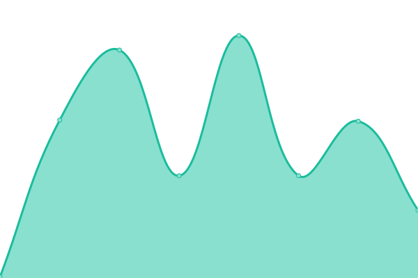

# [📈 Live Status](https://status.constructions-incongrues.net): <!--live status--> **🟧 Partial outage**

This repository contains the open-source uptime monitor and status page for [Constructions Incongrues](https://constructions-incongrues.net), powered by [Upptime](https://github.com/upptime/upptime).

With [Upptime](https://upptime.js.org), you can get your own unlimited and free uptime monitor and status page, powered entirely by a GitHub repository. We use [Issues](https://github.com/constructions-incongrues/status/issues) as incident reports, [Actions](https://github.com/constructions-incongrues/status/actions) as uptime monitors, and [Pages](https://status.constructions-incongrues.net) for the status page.

<!--start: status pages-->
<!-- This summary is generated by Upptime (https://github.com/upptime/upptime) -->
<!-- Do not edit this manually, your changes will be overwritten -->
<!-- prettier-ignore -->
| URL | Status | History | Response Time | Uptime |
| --- | ------ | ------- | ------------- | ------ |
|  [Da ! Heard It Records - home](https://daheardit-records.net/fr/) | 🟥 Down | [da-heard-it-records-home.yml](https://github.com/constructions-incongrues/status-constructions/commits/HEAD/history/da-heard-it-records-home.yml) | 

 742ms
     
 | 

<a href="https://status.constructions-incongrues.net/history/da-heard-it-records-home">62.60%</a>
    

|  [Discutons](https://discutons.incongru.org) | 🟩 Up | [discutons.yml](https://github.com/constructions-incongrues/status-constructions/commits/HEAD/history/discutons.yml) | 

 1661ms
     
 | 

<a href="https://status.constructions-incongrues.net/history/discutons">98.85%</a>
    

|  [Empilements](https://empilements.incongru.org) | 🟩 Up | [empilements.yml](https://github.com/constructions-incongrues/status-constructions/commits/HEAD/history/empilements.yml) | 

 328ms
     
 | 

<a href="https://status.constructions-incongrues.net/history/empilements">100.00%</a>
    

|  [Hypercriture](https://hypercriture.incongru.org/) | 🟩 Up | [hypercriture.yml](https://github.com/constructions-incongrues/status-constructions/commits/HEAD/history/hypercriture.yml) | 

 759ms
     
 | 

<a href="https://status.constructions-incongrues.net/history/hypercriture">100.00%</a>
    

|  [Le Grand Cahier](https://legrandcahier.incongru.org) | 🟥 Down | [le-grand-cahier.yml](https://github.com/constructions-incongrues/status-constructions/commits/HEAD/history/le-grand-cahier.yml) | 

 0ms
     
 | 

<a href="https://status.constructions-incongrues.net/history/le-grand-cahier">100.00%</a>
    

|  [URL Info](https://urlinfo.incongru.org) | 🟥 Down | [url-info.yml](https://github.com/constructions-incongrues/status-constructions/commits/HEAD/history/url-info.yml) | 

 730ms
     
 | 

<a href="https://status.constructions-incongrues.net/history/url-info">62.73%</a>
    

|  [Mazemod](https://www.mazemod.org) | 🟥 Down | [mazemod.yml](https://github.com/constructions-incongrues/status-constructions/commits/HEAD/history/mazemod.yml) | 

 686ms
     
 | 

<a href="https://status.constructions-incongrues.net/history/mazemod">62.81%</a>
    

|  [Mille Milliards - Identités](https://www.millemilliards.net/identites/) | 🟥 Down | [mille-milliards-identites.yml](https://github.com/constructions-incongrues/status-constructions/commits/HEAD/history/mille-milliards-identites.yml) | 

 569ms
     
 | 

<a href="https://status.constructions-incongrues.net/history/mille-milliards-identites">62.93%</a>
    

|  [Mille Milliards - Tirages Ingrats](https://tiragesingrats.millemilliards.net/) | 🟥 Down | [mille-milliards-tirages-ingrats.yml](https://github.com/constructions-incongrues/status-constructions/commits/HEAD/history/mille-milliards-tirages-ingrats.yml) | 

 21571ms
     
 | 

<a href="https://status.constructions-incongrues.net/history/mille-milliards-tirages-ingrats">66.96%</a>
    

|  [Musique Approximative](https://www.musiqueapproximative.net/) | 🟥 Down | [musique-approximative.yml](https://github.com/constructions-incongrues/status-constructions/commits/HEAD/history/musique-approximative.yml) | 

 843ms
     
 | 

<a href="https://status.constructions-incongrues.net/history/musique-approximative">67.05%</a>
    

|  [Musique Approximative - Radio](https://radio.musiqueapproximative.net) | 🟥 Down | [musique-approximative-radio.yml](https://github.com/constructions-incongrues/status-constructions/commits/HEAD/history/musique-approximative-radio.yml) | 

 692ms
     
 | 

<a href="https://status.constructions-incongrues.net/history/musique-approximative-radio">67.14%</a>
    

|  [Musiques Incongrues](https://www.musiques-incongrues.net/forum/people/) | 🟥 Down | [musiques-incongrues.yml](https://github.com/constructions-incongrues/status-constructions/commits/HEAD/history/musiques-incongrues.yml) | 

 194ms
     
 | 

<a href="https://status.constructions-incongrues.net/history/musiques-incongrues">0.00%</a>
    

|  [Ouïedire](https://www.ouiedire.net/) | 🟥 Down | [ouiedire.yml](https://github.com/constructions-incongrues/status-constructions/commits/HEAD/history/ouiedire.yml) | 

 661ms
     
 | 

<a href="https://status.constructions-incongrues.net/history/ouiedire">64.94%</a>
    

|  [Pardon My French](https://www.pardon-my-french.fr/) | 🟥 Down | [pardon-my-french.yml](https://github.com/constructions-incongrues/status-constructions/commits/HEAD/history/pardon-my-french.yml) | 

 814ms
     
 | 

<a href="https://status.constructions-incongrues.net/history/pardon-my-french">67.07%</a>
    

|  [Partouze Cagoule](https://partouze-cagoule.fr/) | 🟥 Down | [partouze-cagoule.yml](https://github.com/constructions-incongrues/status-constructions/commits/HEAD/history/partouze-cagoule.yml) | 

 438ms
     
 | 

<a href="https://status.constructions-incongrues.net/history/partouze-cagoule">67.16%</a>
    

|  [Signé Sexe](https://signesexe.partouze-cagoule.fr/) | 🟥 Down | [signe-sexe.yml](https://github.com/constructions-incongrues/status-constructions/commits/HEAD/history/signe-sexe.yml) | 

 442ms
     
 | 

<a href="https://status.constructions-incongrues.net/history/signe-sexe">67.25%</a>
    

|  [Kneeporn](https://kneeporn.partouze-cagoule.fr/) | 🟥 Down | [kneeporn.yml](https://github.com/constructions-incongrues/status-constructions/commits/HEAD/history/kneeporn.yml) | 

 465ms
     
 | 

<a href="https://status.constructions-incongrues.net/history/kneeporn">67.34%</a>
    

|  [Rosebud](https://rosebud.partouze-cagoule.fr/) | 🟥 Down | [rosebud.yml](https://github.com/constructions-incongrues/status-constructions/commits/HEAD/history/rosebud.yml) | 

 463ms
     
 | 

<a href="https://status.constructions-incongrues.net/history/rosebud">67.57%</a>
    

|  [Pastis Hosting](https://www.pastis-hosting.net/) | 🟩 Up | [pastis-hosting.yml](https://github.com/constructions-incongrues/status-constructions/commits/HEAD/history/pastis-hosting.yml) | 

 141ms
     
 | 

<a href="https://status.constructions-incongrues.net/history/pastis-hosting">100.00%</a>
    

|  [Coller](https://coller.resterdigne.net) | 🟥 Down | [coller.yml](https://github.com/constructions-incongrues/status-constructions/commits/HEAD/history/coller.yml) | 

 680ms
     
 | 

<a href="https://status.constructions-incongrues.net/history/coller">67.64%</a>
    

|  [Faire Caca 2017](https://fairecaca2017.resterdigne.net) | 🟩 Up | [faire-caca-2017.yml](https://github.com/constructions-incongrues/status-constructions/commits/HEAD/history/faire-caca-2017.yml) | 

 965ms
     
 | 

<a href="https://status.constructions-incongrues.net/history/faire-caca-2017">72.96%</a>
    

|  [La Grande Purge](https://lagrandepurge.resterdigne.net) | 🟥 Down | [la-grande-purge.yml](https://github.com/constructions-incongrues/status-constructions/commits/HEAD/history/la-grande-purge.yml) | 

 3276ms
     
 | 

<a href="https://status.constructions-incongrues.net/history/la-grande-purge">67.75%</a>
    

|  [Aire de Jeux](https://airedejeux.ruedesgardes.org) | 🟩 Up | [aire-de-jeux.yml](https://github.com/constructions-incongrues/status-constructions/commits/HEAD/history/aire-de-jeux.yml) | 

 238ms
     
 | 

<a href="https://status.constructions-incongrues.net/history/aire-de-jeux">100.00%</a>
    

|  [Pouézie](https://pouezie.ruedesgardes.org) | 🟥 Down | [pouezie.yml](https://github.com/constructions-incongrues/status-constructions/commits/HEAD/history/pouezie.yml) | 

 593ms
     
 | 

<a href="https://status.constructions-incongrues.net/history/pouezie">67.82%</a>
    

|  [The Brain](https://www.thebrainradio.com/) | 🟥 Down | [the-brain.yml](https://github.com/constructions-incongrues/status-constructions/commits/HEAD/history/the-brain.yml) | 

 1305ms
     
 | 

<a href="https://status.constructions-incongrues.net/history/the-brain">67.90%</a>
    

|  [This Is Radioclash](https://www.thisisradioclash.org/) | 🟥 Down | [this-is-radioclash.yml](https://github.com/constructions-incongrues/status-constructions/commits/HEAD/history/this-is-radioclash.yml) | 

 760ms
     
 | 

<a href="https://status.constructions-incongrues.net/history/this-is-radioclash">67.97%</a>
    

<!--end: status pages-->

[**Visit our status website →**](https://status.constructions-incongrues.net)

## 📄 License

- Powered by: [Upptime](https://github.com/upptime/upptime)
- Code: [MIT](./LICENSE) © [Constructions Incongrues](https://constructions-incongrues.net)
- Data in the `./history` directory: [Open Database License](https://opendatacommons.org/licenses/odbl/1-0/)
