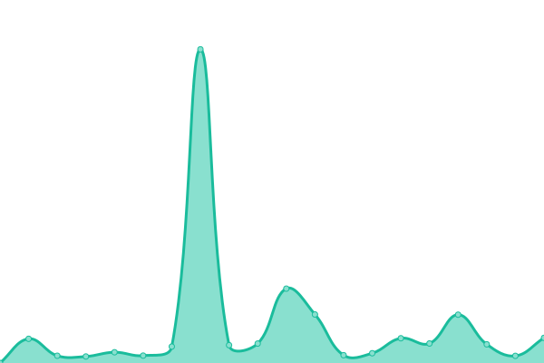
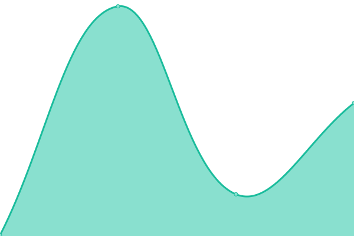

# [📈 Live Status](https://status.constructions-incongrues.net): <!--live status--> **🟧 Partial outage**

This repository contains the open-source uptime monitor and status page for [Constructions Incongrues](https://constructions-incongrues.net), powered by [Upptime](https://github.com/upptime/upptime).

With [Upptime](https://upptime.js.org), you can get your own unlimited and free uptime monitor and status page, powered entirely by a GitHub repository. We use [Issues](https://github.com/constructions-incongrues/status/issues) as incident reports, [Actions](https://github.com/constructions-incongrues/status/actions) as uptime monitors, and [Pages](https://status.constructions-incongrues.net) for the status page.

<!--start: status pages-->
<!-- This summary is generated by Upptime (https://github.com/upptime/upptime) -->
<!-- Do not edit this manually, your changes will be overwritten -->
<!-- prettier-ignore -->
| URL | Status | History | Response Time | Uptime |
| --- | ------ | ------- | ------------- | ------ |
|  [pastis-hosting.net](https://pastis-hosting.net) | 🟥 Down | [pastis-hosting-net.yml](https://github.com/constructions-incongrues/status/commits/HEAD/history/pastis-hosting-net.yml) | 

 0ms
     
 | 

<a href="https://status.constructions-incongrues.net/history/pastis-hosting-net">0.00%</a>
    

|  [rebecca.pastis-hosting.net](https://rebecca.pastis-hosting.net) | 🟩 Up | [rebecca-pastis-hosting-net.yml](https://github.com/constructions-incongrues/status/commits/HEAD/history/rebecca-pastis-hosting-net.yml) | 

 2177ms
     
 | 

<a href="https://status.constructions-incongrues.net/history/rebecca-pastis-hosting-net">56.52%</a>
    

|  [mirror.pastis-hosting.net](https://mirror.pastis-hosting.net) | 🟩 Up | [mirror-pastis-hosting-net.yml](https://github.com/constructions-incongrues/status/commits/HEAD/history/mirror-pastis-hosting-net.yml) | 

 254ms
     
 | 

<a href="https://status.constructions-incongrues.net/history/mirror-pastis-hosting-net">100.00%</a>
    

|  [traefik.pastis-hosting.net](https://traefik.pastis-hosting.net) | 🟩 Up | [traefik-pastis-hosting-net.yml](https://github.com/constructions-incongrues/status/commits/HEAD/history/traefik-pastis-hosting-net.yml) | 

 9560ms
     
 | 

<a href="https://status.constructions-incongrues.net/history/traefik-pastis-hosting-net">62.19%</a>
    

|  [portainer.pastis-hosting.net](https://portainer.pastis-hosting.net) | 🟩 Up | [portainer-pastis-hosting-net.yml](https://github.com/constructions-incongrues/status/commits/HEAD/history/portainer-pastis-hosting-net.yml) | 

 4109ms
     
 | 

<a href="https://status.constructions-incongrues.net/history/portainer-pastis-hosting-net">63.87%</a>
    

|  [docker.pastis-hosting.net](https://docker.pastis-hosting.net) | 🟥 Down | [docker-pastis-hosting-net.yml](https://github.com/constructions-incongrues/status/commits/HEAD/history/docker-pastis-hosting-net.yml) | 

 0ms
     
 | 

<a href="https://status.constructions-incongrues.net/history/docker-pastis-hosting-net">0.00%</a>
    

|  [status.pastis-hosting.net](https://status.pastis-hosting.net) | 🟩 Up | [status-pastis-hosting-net.yml](https://github.com/constructions-incongrues/status/commits/HEAD/history/status-pastis-hosting-net.yml) | 

 115ms
     
 | 

<a href="https://status.constructions-incongrues.net/history/status-pastis-hosting-net">100.00%</a>
    

|  [parishq.net](https://parishq.net) | 🟩 Up | [parishq-net.yml](https://github.com/constructions-incongrues/status/commits/HEAD/history/parishq-net.yml) | 

 1896ms
     
 | 

<a href="https://status.constructions-incongrues.net/history/parishq-net">62.95%</a>
    

|  [computertruck.parishq.net](https://computertruck.parishq.net) | 🟩 Up | [computertruck-parishq-net.yml](https://github.com/constructions-incongrues/status/commits/HEAD/history/computertruck-parishq-net.yml) | 

 4479ms
     
 | 

<a href="https://status.constructions-incongrues.net/history/computertruck-parishq-net">64.79%</a>
    

|  [divag.parishq.net](https://divag.parishq.net) | 🟩 Up | [divag-parishq-net.yml](https://github.com/constructions-incongrues/status/commits/HEAD/history/divag-parishq-net.yml) | 

 5485ms
     
 | 

<a href="https://status.constructions-incongrues.net/history/divag-parishq-net">67.34%</a>
    

|  [gallery.parishq.net](https://gallery.parishq.net) | 🟩 Up | [gallery-parishq-net.yml](https://github.com/constructions-incongrues/status/commits/HEAD/history/gallery-parishq-net.yml) | 

 7520ms
     
 | 

<a href="https://status.constructions-incongrues.net/history/gallery-parishq-net">77.57%</a>
    

|  [labitabertier.parishq.net](https://labitabertier.parishq.net) | 🟩 Up | [labitabertier-parishq-net.yml](https://github.com/constructions-incongrues/status/commits/HEAD/history/labitabertier-parishq-net.yml) | 

 4498ms
     
 | 

<a href="https://status.constructions-incongrues.net/history/labitabertier-parishq-net">84.02%</a>
    

|  [arrachetoiunoeil.com](https://arrachetoiunoeil.com) | 🟩 Up | [arrachetoiunoeil-com.yml](https://github.com/constructions-incongrues/status/commits/HEAD/history/arrachetoiunoeil-com.yml) | 

 2552ms
     
 | 

<a href="https://status.constructions-incongrues.net/history/arrachetoiunoeil-com">29.69%</a>
    

|  [thebrainradio.com](https://thebrainradio.com) | 🟩 Up | [thebrainradio-com.yml](https://github.com/constructions-incongrues/status/commits/HEAD/history/thebrainradio-com.yml) | 

 2313ms
     
 | 

<a href="https://status.constructions-incongrues.net/history/thebrainradio-com">64.06%</a>
    

|  [thisisradioclash.org](https://thisisradioclash.org) | 🟩 Up | [thisisradioclash-org.yml](https://github.com/constructions-incongrues/status/commits/HEAD/history/thisisradioclash-org.yml) | 

 1779ms
     
 | 

<a href="https://status.constructions-incongrues.net/history/thisisradioclash-org">64.32%</a>
    

|  [chipndamned.com](https://chipndamned.com) | 🟩 Up | [chipndamned-com.yml](https://github.com/constructions-incongrues/status/commits/HEAD/history/chipndamned-com.yml) | 

 2822ms
     
 | 

<a href="https://status.constructions-incongrues.net/history/chipndamned-com">64.41%</a>
    

|  [mazemod.org](https://mazemod.org) | 🟩 Up | [mazemod-org.yml](https://github.com/constructions-incongrues/status/commits/HEAD/history/mazemod-org.yml) | 

 2656ms
     
 | 

<a href="https://status.constructions-incongrues.net/history/mazemod-org">60.24%</a>
    

|  [pardon-my-french.fr](https://pardon-my-french.fr) | 🟩 Up | [pardon-my-french-fr.yml](https://github.com/constructions-incongrues/status/commits/HEAD/history/pardon-my-french-fr.yml) | 

 1824ms
     
 | 

<a href="https://status.constructions-incongrues.net/history/pardon-my-french-fr">49.78%</a>
    

|  [millemilliards.net](https://millemilliards.net) | 🟥 Down | [millemilliards-net.yml](https://github.com/constructions-incongrues/status/commits/HEAD/history/millemilliards-net.yml) | 

 0ms
     
 | 

<a href="https://status.constructions-incongrues.net/history/millemilliards-net">0.00%</a>
    

|  [moncul.org](https://moncul.org) | 🟩 Up | [moncul-org.yml](https://github.com/constructions-incongrues/status/commits/HEAD/history/moncul-org.yml) | 

 2883ms
     
 | 

<a href="https://status.constructions-incongrues.net/history/moncul-org">34.33%</a>
    

|  [tiragesingrats.millemilliards.net](https://tiragesingrats.millemilliards.net) | 🟥 Down | [tiragesingrats-millemilliards-net.yml](https://github.com/constructions-incongrues/status/commits/HEAD/history/tiragesingrats-millemilliards-net.yml) | 

 342ms
     
 | 

<a href="https://status.constructions-incongrues.net/history/tiragesingrats-millemilliards-net">0.00%</a>
    

|  [partouze-cagoule.fr](https://partouze-cagoule.fr) | 🟩 Up | [partouze-cagoule-fr.yml](https://github.com/constructions-incongrues/status/commits/HEAD/history/partouze-cagoule-fr.yml) | 

 2322ms
     
 | 

<a href="https://status.constructions-incongrues.net/history/partouze-cagoule-fr">68.67%</a>
    

|  [resterdigne.net](https://resterdigne.net) | 🟩 Up | [resterdigne-net.yml](https://github.com/constructions-incongrues/status/commits/HEAD/history/resterdigne-net.yml) | 

 4781ms
     
 | 

<a href="https://status.constructions-incongrues.net/history/resterdigne-net">69.04%</a>
    

|  [mauvaisbon.resterdigne.net](https://mauvaisbon.resterdigne.net) | 🟩 Up | [mauvaisbon-resterdigne-net.yml](https://github.com/constructions-incongrues/status/commits/HEAD/history/mauvaisbon-resterdigne-net.yml) | 

 2914ms
     
 | 

<a href="https://status.constructions-incongrues.net/history/mauvaisbon-resterdigne-net">54.38%</a>
    

|  [norme.resterdigne.net](https://norme.resterdigne.net) | 🟩 Up | [norme-resterdigne-net.yml](https://github.com/constructions-incongrues/status/commits/HEAD/history/norme-resterdigne-net.yml) | 

 2604ms
     
 | 

<a href="https://status.constructions-incongrues.net/history/norme-resterdigne-net">55.56%</a>
    

|  [cherjournal.resterdigne.net](https://cherjournal.resterdigne.net) | 🟩 Up | [cherjournal-resterdigne-net.yml](https://github.com/constructions-incongrues/status/commits/HEAD/history/cherjournal-resterdigne-net.yml) | 

 597ms
     
 | 

<a href="https://status.constructions-incongrues.net/history/cherjournal-resterdigne-net">60.55%</a>
    

|  [notgay.resterdigne.net](https://notgay.resterdigne.net) | 🟩 Up | [notgay-resterdigne-net.yml](https://github.com/constructions-incongrues/status/commits/HEAD/history/notgay-resterdigne-net.yml) | 

 580ms
     
 | 

<a href="https://status.constructions-incongrues.net/history/notgay-resterdigne-net">73.25%</a>
    

|  [sauvemoidesagios.resterdigne.net](https://sauvemoidesagios.resterdigne.net) | 🟩 Up | [sauvemoidesagios-resterdigne-net.yml](https://github.com/constructions-incongrues/status/commits/HEAD/history/sauvemoidesagios-resterdigne-net.yml) | 

 5124ms
     
 | 

<a href="https://status.constructions-incongrues.net/history/sauvemoidesagios-resterdigne-net">47.34%</a>
    

|  [tasp.resterdigne.net](https://tasp.resterdigne.net) | 🟩 Up | [tasp-resterdigne-net.yml](https://github.com/constructions-incongrues/status/commits/HEAD/history/tasp-resterdigne-net.yml) | 

 1498ms
     
 | 

<a href="https://status.constructions-incongrues.net/history/tasp-resterdigne-net">60.61%</a>
    

|  [lesetoilesflottantes.resterdigne.net](https://lesetoilesflottantes.resterdigne.net) | 🟩 Up | [lesetoilesflottantes-resterdigne-net.yml](https://github.com/constructions-incongrues/status/commits/HEAD/history/lesetoilesflottantes-resterdigne-net.yml) | 

 2514ms
     
 | 

<a href="https://status.constructions-incongrues.net/history/lesetoilesflottantes-resterdigne-net">67.70%</a>
    

|  [fairecaca2017.resterdigne.net](https://fairecaca2017.resterdigne.net) | 🟩 Up | [fairecaca2017-resterdigne-net.yml](https://github.com/constructions-incongrues/status/commits/HEAD/history/fairecaca2017-resterdigne-net.yml) | 

 6959ms
     
 | 

<a href="https://status.constructions-incongrues.net/history/fairecaca2017-resterdigne-net">57.08%</a>
    

|  [vincentcesoir.resterdigne.net](https://vincentcesoir.resterdigne.net) | 🟩 Up | [vincentcesoir-resterdigne-net.yml](https://github.com/constructions-incongrues/status/commits/HEAD/history/vincentcesoir-resterdigne-net.yml) | 

 1522ms
     
 | 

<a href="https://status.constructions-incongrues.net/history/vincentcesoir-resterdigne-net">100.00%</a>
    

|  [lagrandepurge.resterdigne.net](https://lagrandepurge.resterdigne.net) | 🟩 Up | [lagrandepurge-resterdigne-net.yml](https://github.com/constructions-incongrues/status/commits/HEAD/history/lagrandepurge-resterdigne-net.yml) | 

 5736ms
     
 | 

<a href="https://status.constructions-incongrues.net/history/lagrandepurge-resterdigne-net">65.98%</a>
    

|  [coller.resterdigne.net](https://coller.resterdigne.net) | 🟩 Up | [coller-resterdigne-net.yml](https://github.com/constructions-incongrues/status/commits/HEAD/history/coller-resterdigne-net.yml) | 

 1547ms
     
 | 

<a href="https://status.constructions-incongrues.net/history/coller-resterdigne-net">65.17%</a>
    

|  [anomouresbingo.partouze-cagoule.fr](https://anomouresbingo.partouze-cagoule.fr) | 🟩 Up | [anomouresbingo-partouze-cagoule-fr.yml](https://github.com/constructions-incongrues/status/commits/HEAD/history/anomouresbingo-partouze-cagoule-fr.yml) | 

 2640ms
     
 | 

<a href="https://status.constructions-incongrues.net/history/anomouresbingo-partouze-cagoule-fr">67.53%</a>
    

|  [kneeporn.partouze-cagoule.fr](https://kneeporn.partouze-cagoule.fr) | 🟩 Up | [kneeporn-partouze-cagoule-fr.yml](https://github.com/constructions-incongrues/status/commits/HEAD/history/kneeporn-partouze-cagoule-fr.yml) | 

 2157ms
     
 | 

<a href="https://status.constructions-incongrues.net/history/kneeporn-partouze-cagoule-fr">64.99%</a>
    

|  [brigademondaine.partouze-cagoule.fr](https://brigademondaine.partouze-cagoule.fr) | 🟩 Up | [brigademondaine-partouze-cagoule-fr.yml](https://github.com/constructions-incongrues/status/commits/HEAD/history/brigademondaine-partouze-cagoule-fr.yml) | 

 813ms
     
 | 

<a href="https://status.constructions-incongrues.net/history/brigademondaine-partouze-cagoule-fr">69.82%</a>
    

|  [rosebud.partouze-cagoule.fr](https://rosebud.partouze-cagoule.fr) | 🟩 Up | [rosebud-partouze-cagoule-fr.yml](https://github.com/constructions-incongrues/status/commits/HEAD/history/rosebud-partouze-cagoule-fr.yml) | 

 1429ms
     
 | 

<a href="https://status.constructions-incongrues.net/history/rosebud-partouze-cagoule-fr">70.32%</a>
    

|  [legrandcahier.partouze-cagoule.fr](https://legrandcahier.partouze-cagoule.fr) | 🟩 Up | [legrandcahier-partouze-cagoule-fr.yml](https://github.com/constructions-incongrues/status/commits/HEAD/history/legrandcahier-partouze-cagoule-fr.yml) | 

 1205ms
     
 | 

<a href="https://status.constructions-incongrues.net/history/legrandcahier-partouze-cagoule-fr">70.53%</a>
    

|  [chattedechevre.partouze-cagoule.fr](https://chattedechevre.partouze-cagoule.fr) | 🟩 Up | [chattedechevre-partouze-cagoule-fr.yml](https://github.com/constructions-incongrues/status/commits/HEAD/history/chattedechevre-partouze-cagoule-fr.yml) | 

 1414ms
     
 | 

<a href="https://status.constructions-incongrues.net/history/chattedechevre-partouze-cagoule-fr">71.06%</a>
    

|  [autoporn.partouze-cagoule.fr](https://autoporn.partouze-cagoule.fr) | 🟩 Up | [autoporn-partouze-cagoule-fr.yml](https://github.com/constructions-incongrues/status/commits/HEAD/history/autoporn-partouze-cagoule-fr.yml) | 

 737ms
     
 | 

<a href="https://status.constructions-incongrues.net/history/autoporn-partouze-cagoule-fr">73.95%</a>
    

|  [letrucapripri.partouze-cagoule.fr](https://letrucapripri.partouze-cagoule.fr) | 🟩 Up | [letrucapripri-partouze-cagoule-fr.yml](https://github.com/constructions-incongrues/status/commits/HEAD/history/letrucapripri-partouze-cagoule-fr.yml) | 

 1120ms
     
 | 

<a href="https://status.constructions-incongrues.net/history/letrucapripri-partouze-cagoule-fr">71.03%</a>
    

|  [foutre.partouze-cagoule.fr](https://foutre.partouze-cagoule.fr) | 🟩 Up | [foutre-partouze-cagoule-fr.yml](https://github.com/constructions-incongrues/status/commits/HEAD/history/foutre-partouze-cagoule-fr.yml) | 

 1241ms
     
 | 

<a href="https://status.constructions-incongrues.net/history/foutre-partouze-cagoule-fr">71.41%</a>
    

|  [signesexe.partouze-cagoule.fr](https://signesexe.partouze-cagoule.fr) | 🟩 Up | [signesexe-partouze-cagoule-fr.yml](https://github.com/constructions-incongrues/status/commits/HEAD/history/signesexe-partouze-cagoule-fr.yml) | 

 2033ms
     
 | 

<a href="https://status.constructions-incongrues.net/history/signesexe-partouze-cagoule-fr">66.74%</a>
    

|  [constructions-incongrues.net](https://constructions-incongrues.net) | 🟩 Up | [constructions-incongrues-net.yml](https://github.com/constructions-incongrues/status/commits/HEAD/history/constructions-incongrues-net.yml) | 

 5746ms
     
 | 

<a href="https://status.constructions-incongrues.net/history/constructions-incongrues-net">60.18%</a>
    

|  [collectionrevue.com](https://collectionrevue.com) | 🟩 Up | [collectionrevue-com.yml](https://github.com/constructions-incongrues/status/commits/HEAD/history/collectionrevue-com.yml) | 

 2735ms
     
 | 

<a href="https://status.constructions-incongrues.net/history/collectionrevue-com">82.97%</a>
    

|  [artcomptantpourrien.constructions-incongrues.net](https://artcomptantpourrien.constructions-incongrues.net) | 🟩 Up | [artcomptantpourrien-constructions-incongrues-net.yml](https://github.com/constructions-incongrues/status/commits/HEAD/history/artcomptantpourrien-constructions-incongrues-net.yml) | 

 1703ms
     
 | 

<a href="https://status.constructions-incongrues.net/history/artcomptantpourrien-constructions-incongrues-net">72.87%</a>
    

|  [standard.constructions-incongrues.net](https://standard.constructions-incongrues.net) | 🟩 Up | [standard-constructions-incongrues-net.yml](https://github.com/constructions-incongrues/status/commits/HEAD/history/standard-constructions-incongrues-net.yml) | 

 2116ms
     
 | 

<a href="https://status.constructions-incongrues.net/history/standard-constructions-incongrues-net">71.88%</a>
    

|  [ivresse.constructions-incongrues.net](https://ivresse.constructions-incongrues.net) | 🟥 Down | [ivresse-constructions-incongrues-net.yml](https://github.com/constructions-incongrues/status/commits/HEAD/history/ivresse-constructions-incongrues-net.yml) | 

 0ms
     
 | 

<a href="https://status.constructions-incongrues.net/history/ivresse-constructions-incongrues-net">0.00%</a>
    

|  [data.constructions-incongrues.net](https://data.constructions-incongrues.net) | 🟩 Up | [data-constructions-incongrues-net.yml](https://github.com/constructions-incongrues/status/commits/HEAD/history/data-constructions-incongrues-net.yml) | 

 1921ms
     
 | 

<a href="https://status.constructions-incongrues.net/history/data-constructions-incongrues-net">72.00%</a>
    

|  [musiqueapproximative.net](https://musiqueapproximative.net) | 🟩 Up | [musiqueapproximative-net.yml](https://github.com/constructions-incongrues/status/commits/HEAD/history/musiqueapproximative-net.yml) | 

 3379ms
     
 | 

<a href="https://status.constructions-incongrues.net/history/musiqueapproximative-net">83.89%</a>
    

|  [radio.musiqueapproximative.net](https://radio.musiqueapproximative.net) | 🟩 Up | [radio-musiqueapproximative-net.yml](https://github.com/constructions-incongrues/status/commits/HEAD/history/radio-musiqueapproximative-net.yml) | 

 4476ms
     
 | 

<a href="https://status.constructions-incongrues.net/history/radio-musiqueapproximative-net">84.78%</a>
    

|  [quickoschantenoel.musiqueapproximative.net](https://quickoschantenoel.musiqueapproximative.net) | 🟩 Up | [quickoschantenoel-musiqueapproximative-net.yml](https://github.com/constructions-incongrues/status/commits/HEAD/history/quickoschantenoel-musiqueapproximative-net.yml) | 

 3863ms
     
 | 

<a href="https://status.constructions-incongrues.net/history/quickoschantenoel-musiqueapproximative-net">83.48%</a>
    

|  [musiques-incongrues.net](https://musiques-incongrues.net) | 🟥 Down | [musiques-incongrues-net.yml](https://github.com/constructions-incongrues/status/commits/HEAD/history/musiques-incongrues-net.yml) | 

 0ms
     
 | 

<a href="https://status.constructions-incongrues.net/history/musiques-incongrues-net">0.00%</a>
    

|  [manager2000.musiques-incongrues.net](https://manager2000.musiques-incongrues.net) | 🟥 Down | [manager2000-musiques-incongrues-net.yml](https://github.com/constructions-incongrues/status/commits/HEAD/history/manager2000-musiques-incongrues-net.yml) | 

 1337ms
     
 | 

<a href="https://status.constructions-incongrues.net/history/manager2000-musiques-incongrues-net">0.00%</a>
    

|  [data.musiques-incongrues.net](https://data.musiques-incongrues.net) | 🟩 Up | [data-musiques-incongrues-net.yml](https://github.com/constructions-incongrues/status/commits/HEAD/history/data-musiques-incongrues-net.yml) | 

 7320ms
     
 | 

<a href="https://status.constructions-incongrues.net/history/data-musiques-incongrues-net">67.10%</a>
    

|  [zeitgeist.musiques-incongrues.net](https://zeitgeist.musiques-incongrues.net) | 🟩 Up | [zeitgeist-musiques-incongrues-net.yml](https://github.com/constructions-incongrues/status/commits/HEAD/history/zeitgeist-musiques-incongrues-net.yml) | 

 4359ms
     
 | 

<a href="https://status.constructions-incongrues.net/history/zeitgeist-musiques-incongrues-net">43.99%</a>
    

|  [simbertier.musiques-incongrues.net](https://simbertier.musiques-incongrues.net) | 🟩 Up | [simbertier-musiques-incongrues-net.yml](https://github.com/constructions-incongrues/status/commits/HEAD/history/simbertier-musiques-incongrues-net.yml) | 

 7031ms
     
 | 

<a href="https://status.constructions-incongrues.net/history/simbertier-musiques-incongrues-net">61.16%</a>
    

|  [ouiedire.net](https://ouiedire.net) | 🟩 Up | [ouiedire-net.yml](https://github.com/constructions-incongrues/status/commits/HEAD/history/ouiedire-net.yml) | 

 1048ms
     
 | 

<a href="https://status.constructions-incongrues.net/history/ouiedire-net">42.28%</a>
    

|  [daheardit-records.net](https://daheardit-records.net) | 🟩 Up | [daheardit-records-net.yml](https://github.com/constructions-incongrues/status/commits/HEAD/history/daheardit-records-net.yml) | 

 4055ms
     
 | 

<a href="https://status.constructions-incongrues.net/history/daheardit-records-net">43.28%</a>
    

|  [api.daheardit-records.net](https://api.daheardit-records.net) | 🟥 Down | [api-daheardit-records-net.yml](https://github.com/constructions-incongrues/status/commits/HEAD/history/api-daheardit-records-net.yml) | 

 358ms
     
 | 

<a href="https://status.constructions-incongrues.net/history/api-daheardit-records-net">0.00%</a>
    

|  [leseditionsduchevet.fr](https://leseditionsduchevet.fr) | 🟩 Up | [leseditionsduchevet-fr.yml](https://github.com/constructions-incongrues/status/commits/HEAD/history/leseditionsduchevet-fr.yml) | 

 6345ms
     
 | 

<a href="https://status.constructions-incongrues.net/history/leseditionsduchevet-fr">52.78%</a>
    

|  [degelite.org](https://degelite.org) | 🟩 Up | [degelite-org.yml](https://github.com/constructions-incongrues/status/commits/HEAD/history/degelite-org.yml) | 

 5813ms
     
 | 

<a href="https://status.constructions-incongrues.net/history/degelite-org">38.75%</a>
    

|  [prototop.be](https://prototop.be) | 🟥 Down | [prototop-be.yml](https://github.com/constructions-incongrues/status/commits/HEAD/history/prototop-be.yml) | 

 0ms
     
 | 

<a href="https://status.constructions-incongrues.net/history/prototop-be">0.00%</a>
    

|  [juliadrouhin.com](https://juliadrouhin.com) | 🟩 Up | [juliadrouhin-com.yml](https://github.com/constructions-incongrues/status/commits/HEAD/history/juliadrouhin-com.yml) | 

 1124ms
     
 | 

<a href="https://status.constructions-incongrues.net/history/juliadrouhin-com">73.77%</a>
    

|  [odilonparis.com](https://odilonparis.com) | 🟩 Up | [odilonparis-com.yml](https://github.com/constructions-incongrues/status/commits/HEAD/history/odilonparis-com.yml) | 

 413ms
     
 | 

<a href="https://status.constructions-incongrues.net/history/odilonparis-com">100.00%</a>
    

|  [institut-serigraphique.com](https://institut-serigraphique.com) | 🟩 Up | [institut-serigraphique-com.yml](https://github.com/constructions-incongrues/status/commits/HEAD/history/institut-serigraphique-com.yml) | 

 4922ms
     
 | 

<a href="https://status.constructions-incongrues.net/history/institut-serigraphique-com">38.94%</a>
    

|  [incongru.org](https://incongru.org) | 🟩 Up | [incongru-org.yml](https://github.com/constructions-incongrues/status/commits/HEAD/history/incongru-org.yml) | 

 6067ms
     
 | 

<a href="https://status.constructions-incongrues.net/history/incongru-org">64.35%</a>
    

|  [morphino.incongru.org](https://morphino.incongru.org) | 🟥 Down | [morphino-incongru-org.yml](https://github.com/constructions-incongrues/status/commits/HEAD/history/morphino-incongru-org.yml) | 

 182ms
     
 | 

<a href="https://status.constructions-incongrues.net/history/morphino-incongru-org">0.00%</a>
    

|  [urlinfo.incongru.org](https://urlinfo.incongru.org) | 🟥 Down | [urlinfo-incongru-org.yml](https://github.com/constructions-incongrues/status/commits/HEAD/history/urlinfo-incongru-org.yml) | 

 146ms
     
 | 

<a href="https://status.constructions-incongrues.net/history/urlinfo-incongru-org">0.00%</a>
    

|  [traficdinfluences.incongru.org](https://traficdinfluences.incongru.org) | 🟥 Down | [traficdinfluences-incongru-org.yml](https://github.com/constructions-incongrues/status/commits/HEAD/history/traficdinfluences-incongru-org.yml) | 

 160ms
     
 | 

<a href="https://status.constructions-incongrues.net/history/traficdinfluences-incongru-org">0.00%</a>
    

|  [cochisecomix.incongru.org](https://cochisecomix.incongru.org) | 🟥 Down | [cochisecomix-incongru-org.yml](https://github.com/constructions-incongrues/status/commits/HEAD/history/cochisecomix-incongru-org.yml) | 

 137ms
     
 | 

<a href="https://status.constructions-incongrues.net/history/cochisecomix-incongru-org">0.00%</a>
    

|  [sms.incongru.org](https://sms.incongru.org) | 🟥 Down | [sms-incongru-org.yml](https://github.com/constructions-incongrues/status/commits/HEAD/history/sms-incongru-org.yml) | 

 111ms
     
 | 

<a href="https://status.constructions-incongrues.net/history/sms-incongru-org">0.00%</a>
    

|  [discutons.incongru.org](https://discutons.incongru.org) | 🟩 Up | [discutons-incongru-org.yml](https://github.com/constructions-incongrues/status/commits/HEAD/history/discutons-incongru-org.yml) | 

 1289ms
     
 | 

<a href="https://status.constructions-incongrues.net/history/discutons-incongru-org">0.00%</a>
    

|  [trashley.incongru.org](https://trashley.incongru.org) | 🟥 Down | [trashley-incongru-org.yml](https://github.com/constructions-incongrues/status/commits/HEAD/history/trashley-incongru-org.yml) | 

 50ms
     
 | 

<a href="https://status.constructions-incongrues.net/history/trashley-incongru-org">0.00%</a>
    

|  [valkiri.incongru.org](https://valkiri.incongru.org) | 🟥 Down | [valkiri-incongru-org.yml](https://github.com/constructions-incongrues/status/commits/HEAD/history/valkiri-incongru-org.yml) | 

 155ms
     
 | 

<a href="https://status.constructions-incongrues.net/history/valkiri-incongru-org">0.00%</a>
    

|  [peurpanique.incongru.org](https://peurpanique.incongru.org) | 🟥 Down | [peurpanique-incongru-org.yml](https://github.com/constructions-incongrues/status/commits/HEAD/history/peurpanique-incongru-org.yml) | 

 59ms
     
 | 

<a href="https://status.constructions-incongrues.net/history/peurpanique-incongru-org">0.00%</a>
    

|  [pyramideoeilsaucisse.incongru.org](https://pyramideoeilsaucisse.incongru.org) | 🟥 Down | [pyramideoeilsaucisse-incongru-org.yml](https://github.com/constructions-incongrues/status/commits/HEAD/history/pyramideoeilsaucisse-incongru-org.yml) | 

 115ms
     
 | 

<a href="https://status.constructions-incongrues.net/history/pyramideoeilsaucisse-incongru-org">0.00%</a>
    

|  [empilements.incongru.org](https://empilements.incongru.org) | 🟥 Down | [empilements-incongru-org.yml](https://github.com/constructions-incongrues/status/commits/HEAD/history/empilements-incongru-org.yml) | 

 51ms
     
 | 

<a href="https://status.constructions-incongrues.net/history/empilements-incongru-org">100.00%</a>
    

|  [cheloutonson.incongru.org](https://cheloutonson.incongru.org) | 🟥 Down | [cheloutonson-incongru-org.yml](https://github.com/constructions-incongrues/status/commits/HEAD/history/cheloutonson-incongru-org.yml) | 

 161ms
     
 | 

<a href="https://status.constructions-incongrues.net/history/cheloutonson-incongru-org">0.00%</a>
    

|  [johan.wip.incongru.org](https://johan.wip.incongru.org) | 🟥 Down | [johan-wip-incongru-org.yml](https://github.com/constructions-incongrues/status/commits/HEAD/history/johan-wip-incongru-org.yml) | 

 0ms
     
 | 

<a href="https://status.constructions-incongrues.net/history/johan-wip-incongru-org">0.00%</a>
    

|  [globalmix.incongru.org](https://globalmix.incongru.org) | 🟥 Down | [globalmix-incongru-org.yml](https://github.com/constructions-incongrues/status/commits/HEAD/history/globalmix-incongru-org.yml) | 

 97ms
     
 | 

<a href="https://status.constructions-incongrues.net/history/globalmix-incongru-org">100.00%</a>
    

|  [learoger.incongru.org](https://learoger.incongru.org) | 🟥 Down | [learoger-incongru-org.yml](https://github.com/constructions-incongrues/status/commits/HEAD/history/learoger-incongru-org.yml) | 

 56ms
     
 | 

<a href="https://status.constructions-incongrues.net/history/learoger-incongru-org">0.00%</a>
    

|  [joyeuxavaversaire.incongru.org](https://joyeuxavaversaire.incongru.org) | 🟥 Down | [joyeuxavaversaire-incongru-org.yml](https://github.com/constructions-incongrues/status/commits/HEAD/history/joyeuxavaversaire-incongru-org.yml) | 

 112ms
     
 | 

<a href="https://status.constructions-incongrues.net/history/joyeuxavaversaire-incongru-org">0.00%</a>
    

|  [frictions.incongru.org](https://frictions.incongru.org) | 🟥 Down | [frictions-incongru-org.yml](https://github.com/constructions-incongrues/status/commits/HEAD/history/frictions-incongru-org.yml) | 

 51ms
     
 | 

<a href="https://status.constructions-incongrues.net/history/frictions-incongru-org">0.00%</a>
    

|  [hourrapourfrederic.incongru.org](https://hourrapourfrederic.incongru.org) | 🟥 Down | [hourrapourfrederic-incongru-org.yml](https://github.com/constructions-incongrues/status/commits/HEAD/history/hourrapourfrederic-incongru-org.yml) | 

 49ms
     
 | 

<a href="https://status.constructions-incongrues.net/history/hourrapourfrederic-incongru-org">0.00%</a>
    

|  [orangejuicerecords.incongru.org](https://orangejuicerecords.incongru.org) | 🟥 Down | [orangejuicerecords-incongru-org.yml](https://github.com/constructions-incongrues/status/commits/HEAD/history/orangejuicerecords-incongru-org.yml) | 

 51ms
     
 | 

<a href="https://status.constructions-incongrues.net/history/orangejuicerecords-incongru-org">0.00%</a>
    

|  [gong.incongru.org](https://gong.incongru.org) | 🟥 Down | [gong-incongru-org.yml](https://github.com/constructions-incongrues/status/commits/HEAD/history/gong-incongru-org.yml) | 

 51ms
     
 | 

<a href="https://status.constructions-incongrues.net/history/gong-incongru-org">0.00%</a>
    

|  [icecast.incongru.org](https://icecast.incongru.org) | 🟥 Down | [icecast-incongru-org.yml](https://github.com/constructions-incongrues/status/commits/HEAD/history/icecast-incongru-org.yml) | 

 54ms
     
 | 

<a href="https://status.constructions-incongrues.net/history/icecast-incongru-org">0.00%</a>
    

|  [rebeccarium.incongru.org](https://rebeccarium.incongru.org) | 🟥 Down | [rebeccarium-incongru-org.yml](https://github.com/constructions-incongrues/status/commits/HEAD/history/rebeccarium-incongru-org.yml) | 

 101ms
     
 | 

<a href="https://status.constructions-incongrues.net/history/rebeccarium-incongru-org">0.00%</a>
    

|  [ruedesgardes.incongru.org](https://ruedesgardes.incongru.org) | 🟥 Down | [ruedesgardes-incongru-org.yml](https://github.com/constructions-incongrues/status/commits/HEAD/history/ruedesgardes-incongru-org.yml) | 

 47ms
     
 | 

<a href="https://status.constructions-incongrues.net/history/ruedesgardes-incongru-org">0.00%</a>
    

|  [mubadi.incongru.org](https://mubadi.incongru.org) | 🟥 Down | [mubadi-incongru-org.yml](https://github.com/constructions-incongrues/status/commits/HEAD/history/mubadi-incongru-org.yml) | 

 45ms
     
 | 

<a href="https://status.constructions-incongrues.net/history/mubadi-incongru-org">100.00%</a>
    

|  [want.incongru.org](https://want.incongru.org) | 🟥 Down | [want-incongru-org.yml](https://github.com/constructions-incongrues/status/commits/HEAD/history/want-incongru-org.yml) | 

 52ms
     
 | 

<a href="https://status.constructions-incongrues.net/history/want-incongru-org">0.00%</a>
    

|  [benetbene.incongru.org](https://benetbene.incongru.org) | 🟥 Down | [benetbene-incongru-org.yml](https://github.com/constructions-incongrues/status/commits/HEAD/history/benetbene-incongru-org.yml) | 

 50ms
     
 | 

<a href="https://status.constructions-incongrues.net/history/benetbene-incongru-org">0.00%</a>
    

|  [miaou.incongru.org](https://miaou.incongru.org) | 🟥 Down | [miaou-incongru-org.yml](https://github.com/constructions-incongrues/status/commits/HEAD/history/miaou-incongru-org.yml) | 

 50ms
     
 | 

<a href="https://status.constructions-incongrues.net/history/miaou-incongru-org">0.00%</a>
    

|  [radiomomi.incongru.org](https://radiomomi.incongru.org) | 🟥 Down | [radiomomi-incongru-org.yml](https://github.com/constructions-incongrues/status/commits/HEAD/history/radiomomi-incongru-org.yml) | 

 47ms
     
 | 

<a href="https://status.constructions-incongrues.net/history/radiomomi-incongru-org">0.00%</a>
    

|  [spoliature.incongru.org](https://spoliature.incongru.org) | 🟥 Down | [spoliature-incongru-org.yml](https://github.com/constructions-incongrues/status/commits/HEAD/history/spoliature-incongru-org.yml) | 

 48ms
     
 | 

<a href="https://status.constructions-incongrues.net/history/spoliature-incongru-org">0.00%</a>
    

|  [barren.incongru.org](https://barren.incongru.org) | 🟥 Down | [barren-incongru-org.yml](https://github.com/constructions-incongrues/status/commits/HEAD/history/barren-incongru-org.yml) | 

 49ms
     
 | 

<a href="https://status.constructions-incongrues.net/history/barren-incongru-org">0.00%</a>
    

|  [tdm.incongru.org](https://tdm.incongru.org) | 🟩 Up | [tdm-incongru-org.yml](https://github.com/constructions-incongrues/status/commits/HEAD/history/tdm-incongru-org.yml) | 

 5224ms
     
 | 

<a href="https://status.constructions-incongrues.net/history/tdm-incongru-org">36.01%</a>
    

<!--end: status pages-->

[**Visit our status website →**](https://status.constructions-incongrues.net)

## 📄 License

- Powered by: [Upptime](https://github.com/upptime/upptime)
- Code: [MIT](./LICENSE) © [Constructions Incongrues](https://constructions-incongrues.net)
- Data in the `./history` directory: [Open Database License](https://opendatacommons.org/licenses/odbl/1-0/)
